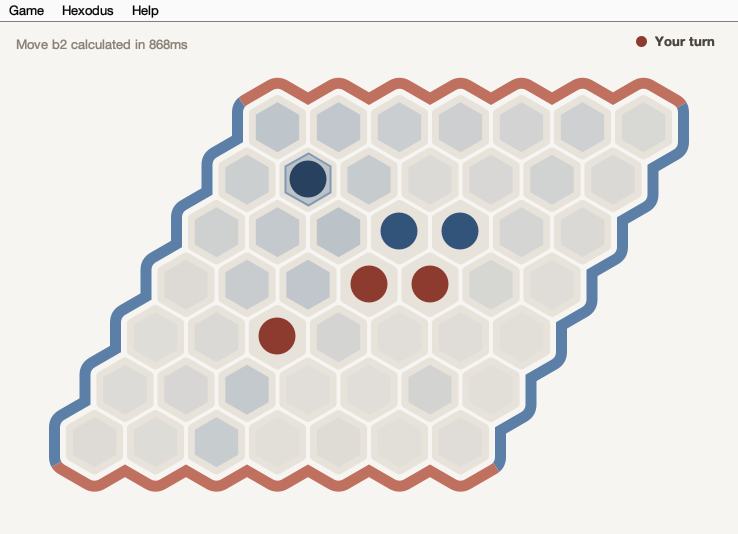

# Hexodus

A Java implementation of the board game **Hex**, with a computer opponent
based on the H-Search algorithm.



Hex is a connection game: you win by joining your two sides of the board
with an unbroken chain of your own stones. It cannot end in a draw, and
although the rules take seconds to learn, playing well is famously hard —
which is what makes it interesting to write an engine for.

## Features

### Playing

- **Board sizes** from 5×5 up to 9×9.
- **Human vs computer, human vs human, or computer vs computer** (a demo
  mode useful for watching the engine play itself).
- **Swap rule** (optional): the second player may take over the first
  player's opening move, which balances the first-move advantage.
- **Move suggestion** — *Hexodus → Suggest Move* marks the move the engine
  would play, leaving you free to accept it or play elsewhere.
- The **most recent stone** is drawn slightly darker, so the last move is
  easy to find on a busy board.
- Moves are reported in the usual Hex notation — a column letter and a row
  number counting from 1, so the top-left cell is `a1`.
- Your board size, difficulty, algorithm and swap choices are
  **remembered between sessions**.

### Difficulty

*Hexodus → Normal / Expert / Master* sets how deep the engine searches
(1, 2 or 3 plies). Deeper play is stronger but much slower, and the cost
grows steeply with board size:

| Board | Normal | Expert |
|-------|--------|--------|
| 5×5   | instant | fast |
| 7×7   | ~1 s / move | seconds |
| 8×8   | ~2.6 s / move | ~75 s / move |
| 9×9   | ~8 s / move | ~4 min / move |

Normal is comfortable at every size; Expert and Master are best kept to
the smaller boards.

### Algorithm selection

The New Game dialog offers two implementations of the same search:

- **Object-Oriented H-Search** — the original implementation, which
  represents each connection path as a list of cell objects.
- **Bitmask H-Search** — the same algorithm with paths held as a 128-bit
  mask, turning the set operations at the heart of the search into a
  couple of machine instructions.

**Both play identical moves.** The choice affects only speed: Bitmask is
roughly 5–7× faster and is the default. The slower version is kept
because the comparison is the interesting part — you can switch between
them mid-project and watch the same game play out at very different
speeds. (Bitmask H-Search supports boards up to 11×11.)

### Watching the engine think

*Hexodus → Show AI Thinking* turns the board into a view of the search:

- Every move the engine **scores** is tinted in that player's colour,
  strongest for the moves it rated best.
- Moves left **untinted were never examined** — alpha-beta pruning
  discarded them, so the empty cells show you what the search skipped.
- A ring marks the **leading move**: dashed while the search is running
  (it may still be beaten), solid once the engine commits.
- The overlay **fills in live**, move by move, while the engine is still
  thinking, with a running count in the status bar. On the deeper levels
  you can watch it work through the position.

## Documentation

A comprehensive technical report is available in the `docs/` directory in [Spanish](docs/Technical_Report_ES.md) (original) and [English](docs/Technical_Report_EN.md) (translated version). It covers the theory behind the engine: virtual connections, the AND/OR deduction rules, and the electrical-resistance model used to evaluate a position.

[OPTIMIZATION_VARIANTS_EXPERIMENT.md](OPTIMIZATION_VARIANTS_EXPERIMENT.md) records the performance work on the engine, including the experiments that did **not** pan out and why.

## Prerequisites

- Java Development Kit (JDK) 8 or higher
- Apache Ant (optional, for using the build.xml)

## Project Structure

```
Hexodus/
├── src/              # Source code
│   ├── game/         # Game rules: board, match, players, moves
│   ├── heuristics/   # The engine: H-Search, resistance evaluation, search
│   ├── ui/           # Swing interface
│   └── images/       # Board artwork and stones (generated, see tools/)
├── test/             # JUnit tests, plus benchmark and comparison harnesses
├── tools/            # Generators for the board and stone artwork
├── docs/             # Technical report and screenshots
├── build/            # Compiled classes (generated)
├── dist/             # Distribution JAR files (generated)
├── build.xml         # Ant build configuration
└── manifest.mf       # JAR manifest file
```

The artwork in `src/images/` is generated rather than hand-drawn, so a new
board size only needs an entry in `Main.DIMENSIONS` and a matching image —
the window layout is derived from the dimension. See
[tools/README.md](tools/README.md).

## How to Compile the Project

### Method 1: Using javac (Manual Compilation)

1. Clean previous builds (optional):
   ```bash
   rm -rf build/classes
   mkdir -p build/classes
   ```

2. Compile all Java source files:
   ```bash
   javac -encoding UTF-8 -d build/classes -sourcepath src $(find src -name "*.java")
   ```

   **Note:** The `-encoding UTF-8` flag is recommended for consistency.

### Method 2: Using Apache Ant

If you have Ant installed, you can use the provided build configuration:

1. Install Apache Ant (if not already installed):
   - macOS: `brew install ant`
   - Linux: `sudo apt-get install ant` or `sudo yum install ant`
   - Windows: Download from https://ant.apache.org/

2. Run the Ant build:
   ```bash
   ant compile
   ```

## How to Generate a JAR File

### Method 1: Using jar command (Manual)

1. First, compile the project (see above)

2. Copy resources to the build directory:
   ```bash
   cp -r src/images build/classes/
   ```

3. Create the distribution directory:
   ```bash
   mkdir -p dist
   ```

4. Generate the JAR file:
   ```bash
   jar cvfm dist/Hexodus.jar manifest.mf -C build/classes .
   ```

   The JAR file will be created at `dist/Hexodus.jar`

   **Note:** The manifest.mf file must contain the Main-Class attribute pointing to `ui.Main`

### Method 2: Using Apache Ant

If you have Ant installed:

```bash
ant jar
```

This will compile the project and create the JAR file in one step.

## How to Run the Application

After generating the JAR file, run the application with:

```bash
java -jar dist/Hexodus.jar
```

Or if you want to run from the compiled classes without creating a JAR:

```bash
java -cp build/classes ui.Main
```

## Quick Build Script

For convenience, you can create a build script. Save this as `build.sh`:

```bash
#!/bin/bash
# Clean and create directories
rm -rf build/classes dist
mkdir -p build/classes dist

# Compile
echo "Compiling..."
javac -encoding UTF-8 -d build/classes -sourcepath src $(find src -name "*.java")

if [ $? -eq 0 ]; then
    echo "Compilation successful!"

    # Copy resources
    echo "Copying resources..."
    cp -r src/images build/classes/

    # Create JAR
    echo "Creating JAR file..."
    jar cvfm dist/Hexodus.jar manifest.mf -C build/classes .

    if [ $? -eq 0 ]; then
        echo "Build complete! JAR file created at dist/Hexodus.jar"
    else
        echo "JAR creation failed!"
        exit 1
    fi
    echo "Run with: java -jar dist/Hexodus.jar"
else
    echo "Compilation failed!"
    exit 1
fi
```

Make it executable:
```bash
chmod +x build.sh
```

Run it:
```bash
./build.sh
```

## Troubleshooting

### Encoding Errors
The source files are encoded in UTF-8. If you encounter encoding errors, ensure you use the `-encoding UTF-8` flag.

### Missing Resources
If images don't appear when running the application, make sure the `images` directory was copied to the build/classes directory before creating the JAR.

### Java Version
The project is configured for Java 1.5 compatibility but should work with any modern Java version (8+).
