**AN APPLICATION FOR PLAYING HEX**

PROJECT TECHNICAL REPORT

UNIVERSITY OF SALAMANCA

TECHNICAL ENGINEERING IN COMPUTER SYSTEMS

Salamanca, June 2007

# Table of Contents

1 - Introduction

2 - Project Objectives

3 - Theoretical Concepts

4 - Techniques and Tools

5 - Relevant Aspects

6 - Conclusions

7 - Acknowledgments

8 - References

# List of Figures

Figure 1. A typical hex board

Figure 2. Turn for white

Figure 3. Turn for black

Figure 4. An implicit connection

Figure 5. An explicit connection

Figure 6. An edge template

Figure 7. And another edge template

Figure 8. Template for distance 5 on large boards

Figure 9. A wall. (Copyright © 2005 Thomas Maarup)

Figure 10. Blocking the way. (Copyright © 2005 Thomas Maarup)

Figure 11. Time versus board dimension

Figure 12. Different connections and semi-connections

Figure 13. A segment of the game tree for tic-tac-toe

Figure 14. Diagram of the AND rule

Figure 15. Diagram of the OR rule

Figure 16. A deduction between A and C

Figure 17. Circuit or board?

Figure 18. Distributing cells among processors for a 2x2 board

Figure 19. Hextress showing results

Figure 20. Time graph for single-processor systems

Figure 21. Time table for two-processor systems

Figure 22. Time table for four-processor systems

Figure 23. Logarithmic scale for dual systems

Figure 24. A somewhat complicated diagram

Figure 25. A position on the board

Figure 26. The graph equivalent

Figure 27. Simplifying cells

Figure 28. Eliminating three cells

# Introduction

Hex is an abstract, zero-sum game between two opponents. It is played on a diamond-shaped board composed of hexagonal cells. The pieces are usually of two different colors, one associated with each opponent, as shown in Figure 1:

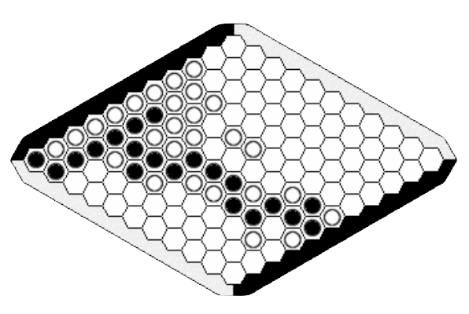

Figure 1. A typical hex board

The player who first forms a chain of pieces of their color connecting the two opposite sides of the board wins. These sides are assigned to each player beforehand and are usually marked in their same color.

Initially the board is empty. Each player is assigned a color and two opposite sides of the board that they must try to connect with their pieces.

From here, players take turns placing their pieces on the board until one of them connects their two edges. Since the game is zero-sum, and due to the geometry of the board, it is not possible to tie a game.

Although the rules of hex are very simple, mastering it is extremely difficult, and in fact its tactical complexity at advanced levels equals that of chess. Deepening the game's tactics generally requires specialized help and much study time. This apparent simplicity and its devilish complexity has enthralled and obsessed some of the brightest minds of our time.

## History

Hex was invented in 1942 by the Danish mathematician **Piet Hein** and independently by **John Nash** in late 1949.

Piet Hein invented the game by chance as part of his studies, spreading it in certain academic circles. Finally, on December 26, 1942, the game was described to the general public in the Danish newspaper **Politiken**, under the name Polygon.

For his part, John Nash invented it independently while studying at Princeton University, as an example of a game in which a winning strategy is known to exist although it is unknown. The game quickly became popular among students.

In 1953, the American company Parker Brothers discovered and gave some publicity to the game, marketing it under the name Hex, in reference to the hexagonal cells that make up the board.

### Shannon and Moore

Shannon and Moore were responsible for building the first machine capable of playing hex following a systematic method. Shannon was a pioneer in identifying any game position with a distribution of electric charges in two dimensions. This allowed the machine to make decisions based on the properties of the corresponding electric field, applying an idea of great beauty. To this day, modern hex programs continue to be based on it.

## Current Development

Currently, hex is a game of growing popularity, especially throughout the American continent, where it enjoys enviable health. Little by little, and especially thanks to the Internet, it is beginning to become popular in Europe.

Hex's relationship with computing has traditionally been difficult, especially due to its high complexity. Therefore, it is not surprising that there are only a few programs that allow us to play hex against a computer.

Currently, there are two major hex games for very powerful and interesting personal computers: **Six** and **Hexy**.

Hexy is a game developed by **Vadim V. Anshelevich** for the Windows platform. Its author is the leading figure in the dissemination of methods for hex computation [1], and we owe everything we know about this topic to his work. However, this application is closed source and paid, and restricted to its platform.

On the other hand, Six is a truly strong program that runs on KDE in Linux. This application is free and open-source software. However, its documentation is practically non-existent. Of course, it doesn't work on Windows and there are no plans for it to do so.

The overall result is that there is very interesting documentation, although not entirely complete, from the author of Hexy, and there are hardly any other sources of documentation from the perspective of software development. The only free alternative, Six, lacks documentation that can be useful for future developments. As for Mac OS users, they are completely marginalized in the current landscape as there is no hex program, however limited, targeting this system.

Consequently, it is clear that there are notable gaps in the computational landscape of hex, gaps that this project aims to help solve. On one hand, it is the first effort to develop a multiplatform, open-source version of a hex game, with the primary objective of serving as a foundation for future work in the field of free software. On the other hand, it is necessary to make a certain amount of documentation on hex computation available to the community, providing new points of view.

Regarding the latter, while it is true that a certain amount of documentation is available in English, hardly anything has been written about hex in Spanish at an advanced level. There are also no programs in this language, and it is understood that this situation, globally, does not favor the expansion of this game in our country in particular or in the Spanish-speaking world in general. This project also aims to collaborate with this expansion.

# Project Objectives

In accordance with the above, the aim is to develop an application capable of playing hex, with open source code, multiplatform and accompanied by a good amount of detailed information that is freely distributed.

It is also an exceptional opportunity to study the current procedures implemented in hex and see how they can be improved or what changes can be suggested. In a broader sense, this project is conceived as a foundation upon which the community can collaborate, democratizing knowledge about this game.

## General Objectives

Thus, with the realization of this project the aim is to:

Develop a program that plays hex based on the study of certain search algorithms.

Develop the first free multiplatform hex game, in such a way that it can reach all users and favor community participation.

Create a knowledge base that is free and without restrictions around hex computation and that facilitates the study of this game, serving as a complement to future work. At the same time, the aim is to serve as a foundation for the popularization of hex and form the first solid documentary base in Spanish on hex computation.

Investigate and test the viability and performance of other systems, specifically multi-threaded systems and how to integrate them into standard search procedures.

These general objectives will be specified throughout the requirements and analysis phases.

# Theoretical Concepts

In this section, we will review some useful concepts for those approaching hex for the first time, and which will help understand certain tactical subtleties and part of the game's underlying logic.

The first reaction before playing for the first time, and the most understandable, is not to expect that such a simple game could be moderately entertaining or exciting. However, this perception will transform into astonishment when one begins to glimpse the real difficulty of the game.

It is very complicated to establish general guidelines or a basic strategy, as we run the risk that this strategy will be too obvious or general. And precisely this difficulty in the precise description of the game's techniques has a great influence on how complicated it is to design programs that play hex.

## Game Theory

**Game theory** is an area of mathematics that uses models to study interactions in formalized incentive structures (games). Its researchers study optimal strategies as well as the expected and observed behavior of individuals in games.

Developed in its beginnings as a tool to understand economic behavior, game theory is currently used in many fields, from biology to philosophy. It was first formalized from the works of **John von Neumann** and **Oskar Morgenstern** [7], before and during the Cold War, experiencing notable growth mainly due to its application to military strategy. Game theory has found applications in political science, ethics and philosophy; and in recent years, it has also attracted the attention of computer science researchers, being used mainly in the field of artificial intelligence.

Although it has some points in common with **decision theory**, game theory studies decisions made in interaction environments. In other words, it studies the choice of optimal behavior when the costs and benefits of each option are not fixed in advance, but depend on the choices of other individuals.

From the point of view of Artificial Intelligence, games are attractive for their abstract nature and for being simple to understand and represent. In addition, their agents are usually restricted to a very limited number of actions defined by precise rules and normally without ambiguity.

Getting computers to play different games was one of the first tasks undertaken in the field of AI, and in fact as early as 1950, coinciding with the development of the first programmable computers, chess computation was addressed by Konrad Zuse, Alan Turing or Claude Shannon.

Games are precisely interesting because, unlike other problems, they are difficult enough to avoid the temptation to solve them by brute force. Thus, chess has a branching factor calculated between 35 and 38, on average, and that of hex is calculated around 100, therefore games require systems to have the ability to make a reasonably good decision in a reasonably short time, regardless of whether it is the optimal decision.

## How to Play Hex

It is not the objective of this report to offer a complete strategic manual on the game, and some references on the subject can be found on the Internet. However, it is considered necessary to make some tactical assessments and offer some examples to complete the perception of the game.

When playing hex, both people and computers must apply two approaches that must be balanced if one wants to succeed. The general idea of the strategy consists of blocking the advance of the opponent's connection while strengthening our own.

The game's own characteristics are very relevant here: since one of the opponents has to be the winner, our strategy can consist of either trying to create our own connection or preventing those of our opponent. If we manage to nullify the opponent's possibilities of connecting their edges, we will have won the game; so it is a matter of finding the move that most benefits our interests while harming those of our adversary.

### The Swap Rule

The swap rule is the only exceptional situation that can occur during a hex game.

The player who starts the game has a great advantage in this game. In particular, on small boards it is very difficult to prevent the first player from winning the game if they make certain moves (usually, occupying the center cell of the board).

With the aim of balancing forces, there is what we call the "swap rule," which allows the second player to decide whether to *appropriate* the move made by the first player. Of course, if this player wishes, they can make another move without swapping colors.

This rule is only executed on the first move, and in practice it means that the player who starts must measure the move they make: if it is very bad it will take away their advantage, and if it is definitely good, the opponent will swap it and that advantage will pass to the opponent. So it is necessary to make a first move that is reasonably good but not very tempting for the opponent. This is usually achieved by occupying cells close to one's own edges, which are unattractive to the opponent.

Generally this rule has an optional character, and players usually agree at the beginning of the game whether they will use it or not. Computer hex games also allow this rule to be activated or deactivated.

As an example, given the following board (3x3), black has placed their piece and it is white's turn:

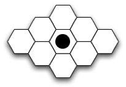

Figure 2. Turn for white

White can make any move and in all cases will lose the game, as they cannot prevent black from connecting their edges in the decisive moves. However, they can swap the move –as it is the first–, and then the game would look like this:

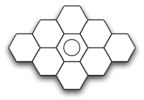

Figure 3. Turn for black

White now occupies the cell chosen by black, who is now in possession of the turn and who has lost the game by making a first move that was too ambitious.

### Recognizing Structures and Templates

There are certain structures in the game whose analysis can be very interesting, mainly because they appear repeated exactly the same in many occasions. We call these structures **templates**, and they consist of a specific position and concrete and unambiguous instructions for responding to the opponent's attempts to nullify them.

Templates help us establish "implicit connections" between two groups of cells. The idea is that an implicit connection can be, under certain conditions, as solid as a firmly established connection between two neighboring cells. Knowing this we can avoid many useless moves and play at a high level of abstraction. At first glance these ideas may seem a bit complex, so it is better to review some examples.

**Bridges**

Obviously, the firm connection between two neighboring cells is the strongest. But we can propose a connection that endures regardless of the opponent's move. This is the simplest version of a virtual or implicit connection and is called a "bridge":

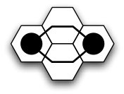

Figure 4. An implicit connection

The opponent cannot prevent black from connecting their two cells; if white interposes in one of the intersection cells, black will place themselves in the other and the connection will be established. In both cases we reach an equivalent of:

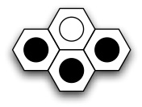

Figure 5. An explicit connection

This is a direct consequence of the hexagonal geometry of the cells and represents a considerable challenge for beginner players. So following this reasoning, we can distinguish two types of connection in hex: **implicit** (or weak) and **explicit** (or strong).

**Edge Templates**

When a player approaches an edge and wants to connect their chain to it, knowing a small number of rules will greatly facilitate this work. These templates consist of specific positions and sets of instructions for responding to a possible intrusion by the opponent in the connection to the edge.

The figure represents an occupied cell next to an edge (lower end). The white player cannot prevent the connection.

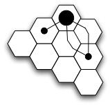

Figure 6. An edge template

Another example: white cannot block both points simultaneously, so they cannot prevent the connection:

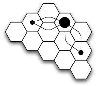

Figure 7. And another edge template

The previous figure shows two examples of edge templates: if the opponent places themselves in any cell trying to block the connection, the white player can place their piece in one of the marked points to maintain the implicit connection.

Edge templates are grouped according to the distance remaining to reach the edge, and the very definition of each template tells us which cells need to be free to ensure the position, which allows us to know when we can use this template. The following illustration shows us the template for distance 5:

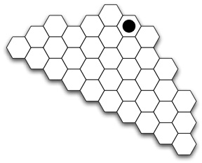

Figure 8. Template for distance 5 on large boards

There are multitudes of templates for many different game situations, although the most useful and important are edge templates. In any case, mastering them is not always necessary if solid reasoning is applied to the position and certain fundamental principles are not forgotten.

**Walls**

Walls or barriers appear when a player is forced by the opponent to form a row parallel to one of their board edges. The opponent thus manages, in principle, to prevent the connection.

The wall represents, at the same time, a valid connection in the direction of the blocking player, so if the blocked player does not break the wall in some way they will lose the game.

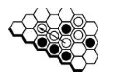

Figure 9. A wall. (Copyright © 2005 Thomas Maarup)

In the previous figure, the black player prevents white from completing a connection with this board edge, forcing them to continue the wall if they want to have any chance of completing this connection.

In turn, black is building a connection, so white must break the wall in some way. There are templates for "breaking" or "escaping" from walls, although it is not necessary to use them.

**Blocks**

The hexagonal nature of the board makes blocking a connection a truly complicated task. If we try to stop a player's advance by placing our piece one cell further away, we are building a block that can be circumvented using adjacent cells.

The classic defense against the bridge is to try to block the connection three cells further away, as shown by the moves labeled with a 2 in the following illustration:

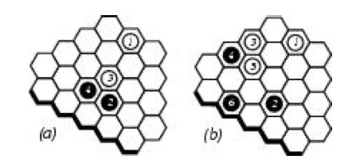

Figure 10. Blocking the way. (Copyright © 2005 Thomas Maarup)

### Some General Principles

There are some very useful general principles in this game that, nevertheless, should be taken as aids and not as strict rules: we must always rely on common sense and calculation.

**Attack = Defense**

In hex, a good attack is as powerful as a good defense. Precisely because it is a zero-sum game, our best offensive move is, at the same time, our best defensive move. Many times, in the course of the game, it is not clearly appreciated what the best offensive move is for a player, but one can think about which one harms the adversary most. There is a very interesting equivalence in this sense: a perfect block is, in turn, a connection.

**Initiative**

It is said that the player who has control of the game's direction has the initiative. Although the initiative oscillates between both players, in hex being in possession of it represents a very remarkable advantage. This concept is related to the "tempo" or "time" of chess, which refers to the **optimization of moves**: one should not do in two moves what can be done in one, as we stop taking advantage of a move and this represents a very clear advantage for the opponent.

In chess, maintaining the initiative is a great tactical help, but in hex it is absolutely essential if one wants to win the game.

**Move Branching**

A good move in hex must allow alternatives to be developed, to deal with the opponent's blocking attempts: if a move consists of several "threads" the opponent will not be able to stop them all.

A bridge between two cells is a good example of this.

**Playing on the Entire Board**

In hex the long term is very important, and consequently we should not limit ourselves to developing our game in a single part of the board. However, it is very complicated to maintain a plan for the entire board, so it is better, in the short term, to divide the game into sections and concentrate on each of them. This does not mean we can ignore the rest of the board.

**Forcing Moves**

There are many sequences of forced moves in hex, which give victory to the opponent if they are not executed. By maintaining the initiative, it may be interesting to force the opponent to make certain moves. There are other variants, such as those derived from intrusions in connections and the application of templates.

**Center Control**

It is important to control the center of the board. From here, connections can take many directions, many more than if they start from the edge, from where there are fewer possibilities.

## Hex Theory

Hex is a very interesting game from a purely mathematical point of view, and as such has fascinated many lovers of this discipline from the very moment of its invention.

Within game theory, hex falls into the category of **finite abstract games** with **two players** with **complete information** and **without the influence of chance** (deterministic). Hex is, in addition, a **zero-sum** game, which in practice implies that there must always be a winner. In this case, moreover, we know that this winner must be unique.

According to this last point, a hex game cannot end in a tie. This property is deduced from the fact that if all the cells on the board are occupied, there must be a winning connection for one of the players. Although this fact seems obvious, the property is not trivial; in fact, it is equivalent to Brouwer's fixed-point theorem for two-dimensional squares [12]. Following this reasoning, it is simple to reach the conclusion that there must be a winning strategy for one of the players, as we will see later.

In any game between two players, with complete and deterministic information (does not depend on chance), there is an optimal strategy that consists of maximizing or minimizing the values assigned to each state of the game. The value of state Ti is assigned recursively provided that Ti is followed by at least one possible move Ti+1.

v(Ti) = 1 if player A has won.

v(Ti) = -1 if player B has won.

v(Ti) = max(v(Ti+1)) if player A moves.

v(Ti) = min(v(Ti+1)) if player B moves.

Given these indicative values, obviously player B must minimize each move and A maximize it. From this we can draw the conclusion that the second player to move has nothing to do if the first player follows their optimal strategy.

Knowing the optimal strategy of a game is a good way to end it. However, the winning strategy in hex continues to be an unknown.

### Winning Strategy

Informally, we call **winning strategy** a sequence of moves that a player has available, that the adversary cannot prevent and that lead them to victory.

As established in the previous section, from the fact that hex is a zero-sum game we can deduce that the first player has a winning strategy, through reasoning that we will now state.

Probably, the fact that the first player has a winning strategy was discovered independently by several mathematicians after the appearance of the game. Hein's original writings suggest he knew this circumstance, and through various works by J. Nash it is known that he also reached this same conclusion using reasoning similar to the following.

We can argue a demonstration of this point using a "strategy stealing" [1, 6]:

Since the first or second player must win, then there must be a winning strategy for one of the players, be it the first or the second.

Suppose that at least the second player possesses a winning strategy.

The first player can adopt the following defense: make a first random move, and subsequently execute the second player's winning strategy that we assume to exist. Adopting this strategy implicitly converts them into the second player, although with an extra piece on the board.

The first piece cannot interfere with the imitation of the winning strategy, because an extra piece always represents an advantage. Therefore the first player can win.

This contradicts the fact of assuming that there is a winning strategy for the second player, so we must discard this possibility.

Consequently, there is a winning strategy for the first player.

This brief and informal demonstration relies on a lemma and a theorem stated below, whose demonstrations will not be seen here as they are not very relevant. They can be consulted in the bibliography on the subject, specifically in [6].

**Lemma 1:** A hex game cannot end in a tie.

This implies that neither both players can win nor can the game end without either player having won. This lemma can be demonstrated by analyzing the hex board as an undirected planar graph.

**Theorem 1:** For any game of dimension n x n, the first player possesses a winning strategy.

It must be warned, however, that this theorem only states the mathematical existence of the winning strategy and does not imply that a practical construction of this strategy exists or that such construction is known.

## Complexity

We have just seen how in hex there is a winning strategy for the first player for boards of any size. We also commented that we could not expect to discover said strategy. In this section we will look for some type of approximation to a general winning strategy.

### Solving Hex by Brute Force

This is a solution to hex that in principle is directly accessible: play all possible hex games. Apparently, by automating this process, it shouldn't be too complicated. But it is.

We could consider any board of n x n cells, number them from 1 to n2 and move pieces on them in order. Thus, the first complete game would begin {1, 2, 3, ..., n2 - 1, n2}, the next would be {1, 2, 3,..., n2 - 2, n2, n2 - 1} and so on.

We can discard a large number of games:

Games that begin {1, 2, 3, 4, 5,...} are the same as those that begin with {3, 2, 1, 4, 5,...}

Many games end before the board is complete, so we could ignore the rest of the moves. We can make an optimistic approximation and assume that, on average, games use half of the available cells.

Finally, half of the games are covered by symmetry.

This leads us to the fact that the total number of games is the number of ways in which one player can occupy a quarter of the cells multiplied by the ways in which the other player can occupy another quarter of the cells, divided by 2:

$$
\frac{
\begin{pmatrix}
n^{2} \\
\frac{1}{4}n^{2}
\end{pmatrix}
\cdot
\begin{pmatrix}
\frac{3}{4}n^{2} \\
\frac{1}{4}n^{2}
\end{pmatrix}
}{2}
$$

If we were able to execute one move per second, a game of dimension n would take us, in seconds [6]:

$$
\frac{n^{2}!\,\left(\tfrac{3}{4}n^{2}\right)!\,n^{2}}
{\left(\tfrac{1}{4}n^{2}\right)!\,\left(\tfrac{3}{4}n^{2}\right)!\,\left(\tfrac{1}{4}n^{2}\right)!\,\left(\tfrac{1}{2}n^{2}\right)!\cdot 4}
$$

Thus for example, fully solving the 2 × 2 board would take 12 seconds. The 3 × 3 would take us 2400 seconds, until we reach the standard 11 × 11 board, for whose resolution we would need 10^54 seconds, or put another way, 3 × 10^46 years. The following image gives a clearer idea of the magnitude of the times, representing time versus dimension, the last visible value corresponds to dimension 4.

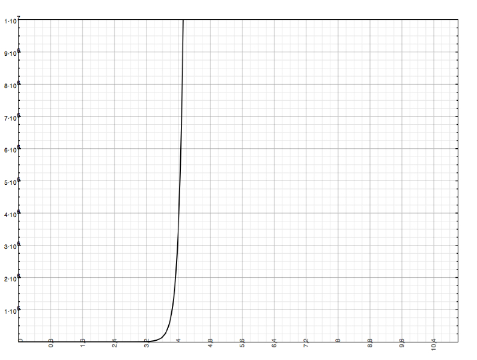

Figure 11. Time versus board dimension

Of course, computers are much faster than this, but it gives us an idea of the time factor needed to solve a large board. It does not seem feasible to completely solve hex in a reasonable period of time.

### Classification

It is important to distinguish between truly **undecidable** problems and those that are only **intractable**. A problem is undecidable when given a general algorithm and a specific input one cannot know if it will always execute or will stop after a finite number of steps.

In principle hex of dimension n x n is a solvable problem, although it is intractable in practice –that is, given any position, we do not have an algorithm that can be executed in polynomial time that allows us to know which player has a winning strategy and obtain it–.

Hex is partially solved for small boards, but really in this case we are interested in finding a general solution as a function of dimension. That the game is **solved** means that for any given position it is known which of the two players has a winning strategy. Proper treatment can also lead us to obtain said strategy.

A solution for hex would consist of an algorithm that can be executed in polynomial time and that returns a winning move for any position on a board of any dimension.

The concept of intractability refers to the availability of computational resources needed to solve a problem. Depending on these needs, problems are classified into different **complexity classes**.

An important characteristic of computability theory is that problems are generally rewritten as **decision problems**, specifically as questions that can be answered with a "yes" or "no." This is useful because it allows us to transform problems and compare them with each other. In our case, we could convert hex into a problem of the type:

| Problem type | Hex |
|---|---|
| Data | A partially filled (or empty) hex board of dimension n×n with a position p. |
| Question | Is move p part of some winning strategy? |

The question can be formulated for the player who has the turn. In case it is answered with a "no," the player should reformulate the question until the evaluation of **all** empty cells yielded a negative answer. In this case the opponent would be the possessor of the winning strategy on the next move.

It is possible to answer this question and use it to discover a winning strategy for any board in finite time. However, the time required to reach a solution **grows above polynomial** in proportion to the size of the problem (in our case, the size of the board).

### P and NP Classes

In the previous section we showed some calculations that demonstrate the enormous amount of time needed to solve the standard version of hex using the only known approach, which is exhaustive. Time grows exponentially as a function of board size.

Around 1960, **Jack Edmonds** introduced the notion of a good algorithm as one that produces an answer in less than polynomial time, relative to the size of the problem. For hex, the problem size is the number n of cells on the board. We normally denote as n the number of edge cells –the dimension–, but for a computational objective it is preferred to denote the total number of cells on the board. In any case, any confusion between the two does not give rise to any practical difference, since n2 can be considered equivalent to n.

A **complexity class P** (polynomial) of problems that are solvable with good algorithms corresponds to this definition. To date, no such algorithm is known that allows solving hex.

Many times, however, a solution to a complicated problem can be verified in some cases in polynomial time: this is the case of the set of problems that can be **solved in polynomial time by a non-deterministic Turing machine**, and which receive the acronym **NP**, for non-deterministic polynomial. It is not clear, but there are reasons to think that P = NP. However, this question has not yet been clarified, although there is a motivating million-dollar prize for whoever proves or rejects the previous equality. In any case, it is normally assumed that P is a subset of NP.

A consequence of the absence of an answer as to whether P = NP is true is that there are problems in NP that we cannot know if they have a good solution or not. Something we know about this group is that if there is a polynomial solution for at least one of them, then we can find polynomial solutions for all NP-complete problems. A problem is considered NP-complete if it is possible to reduce all problems in NP to it through a polynomial transformation, which implies that transforming a known NP-complete problem into an NP problem will prove it is NP-complete.

It is known that Hex is at least as complicated as an NP-complete problem, which we refer to as NP-hard.

### Hex is PSPACE-Complete

**Stefan Reisch** demonstrated [4] that hex is a complete problem in P space. For his part, a few years earlier, **Simon Even** and **R. E. Tarjan** showed [3] that a generalized version of hex called "Shannon Switching Game" is PSPACE-complete.

Both demonstrations start from the reasoning classification in the previous section and are complex enough not to be treated here. They can be consulted in the referenced bibliography.

## A Formal Approach

So far we have made some general assessments around hex, providing some useful ideas for understanding a deeper study of the game and the resources that we humans can use in hex. However, our objective is to build a system capable of playing hex on its own and for this we must formalize as much as possible some of the concepts studied previously. A more systematic support will allow us to draw equivalences between the ideas and techniques of hex and computational language more easily.

This may seem like a contradiction, especially when we have just shown the difficulty of finding a computationally systematic solution. However, computers are capable of playing hex reasonably well, so we can think that there is some method to simplify the study of the game. Throughout this section and the following ones we will introduce some ideas in this sense, until we reach a method that allows us to choose the best available move.

Although the rules of Hex are simple, the game requires deep knowledge of strategy and important tactical skills. Mass tree search techniques, developed over the last forty years mainly for chess and used successfully in checkers, are much less useful in games with high branching factors such as Hex or Go. In fact, for a conventional Hex board of 11 x 11, the average legal moves is 100, while for chess it is 38 and for checkers it is 8, as mentioned in the introduction.

The analysis of hex requires, in this sense, a more sophisticated approach than in the case of other games: hex is very simple in its conception, and what makes one move better than another responds to very subtle differences and a long-term approach. In addition, there is hardly any room for error, except if the situation is very well secured. This makes the work of computational analysis of hex positions very delicate and quite complex.

### Hierarchy as a Starting Point

In the study of games in general, complex positions can be decomposed into sums of simpler positions. It can be considered that a game can be decomposed into several subgames. This is a method that is applied in Go computation, a game of recognized computational complexity.

Although not all Hex positions can be decomposed into a sum of "local" games, many can be considered combinations of simpler games. By applying various deduction rules to the simpler subgames we can see how they can be used recursively to calculate values of more complex subgames.

Below are some considerations directed at the subsequent study of a heuristic function that allows analyzing the game. For this study, certain game characteristics must be taken into account, which are explained below.

### Virtual Connections and Semi-Connections

Edges can be considered as cells of the corresponding color, to generalize the way the system treats connections.

**Note**: The following definitions are proposed, for simplicity, from the point of view of one player (black), but the idea for the adversary is equivalent.

**Definition 1: Subgame**

Let x and y be two different cells, and let A be a set of empty cells in a given position. Assuming that x ∉ A and y ∉ A, we can consider the triple (x, A, y) as a subgame, where the black player tries to connect x with y by means of a chain of black pieces, the white player tries to prevent it and both players can only place their pieces in the cells of A.

We define x and y as ends or endpoints of the subgame and A as the path between them.

**Definition 2: Virtual Connection**

A subgame is a virtual connection if and only if the black player has a winning strategy even if white plays first.

**Definition 3: Virtual Semi-Connection**

A subgame is a virtual semi-connection if and only if the black player has a winning strategy when moving first and not when moving second.

Although a virtual connection is not physically established, it is impossible to avoid, so the cells involved in a virtual connection are connected de facto or virtually. Virtual semi-connections receive this name because by themselves they cannot be considered a connection, although they can be in combination with others. Thus, two virtual semi-connections between two cells are equivalent to a virtual connection.

In practice it is convenient to use the following recursive definitions (definitions 4 and 5).

**Definition 4 (recursive):** **Virtual Connection**

A subgame is a virtual connection if and only if for every white move there is a black move that makes the resulting subgame a virtual connection.

**Definition 5 (recursive):** **Virtual Semi-Connection**

A subgame is a virtual semi-connection if and only if it is not a virtual connection and there is a black move that makes the resulting subgame a virtual connection.

We usually represent virtual connections with a white rectangle between cells and virtual semi-connections with a crossed rectangle (in this case, darkened) between cells, as shown in the following figure:

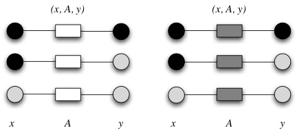

Figure 12. Different connections and semi-connections

**Definition 6: Depth of a Virtual Connection**

Let a position be a virtual connection and white be the first to play. The number of moves that must be executed for black to win the subgame, considering that black tries to minimize it and white to maximize it, characterizes the depth of the virtual connection.

The depth of a virtual connection is equivalent to the game tree search depth required to establish the virtual connection on the board.

*Examples*:

Two neighboring cells form a virtual connection with an empty route, with a depth of 0.

A double bridge forms a virtual connection of depth 2.

**Definition 7: Minimal Connection**

The virtual connection (x, A, y) is minimal if and only if there is no virtual connection (x, B, y) such that B ⊂ A (B subset of A) and B ≠ A. If a subgame (x, A, y) is a virtual connection and (x, C, y) is a subgame such that A ⊂ C, the game (x, C, y) is a virtual connection.

**Definition 8: Winning Virtual Connection**

A virtual connection between edge cells is equivalent to winning the game. If it exists, there also exists a winning strategy for the black player even if the white player moves first.

## Description of the Heuristic

Once certain ideas have been established, we can now introduce a first approximation to the most "intelligent" part of the application. But first let's see some notions around this concept.

Specifically, the idea that this type of system is, in reality, a problem of searching for solutions is important. A **search algorithm** takes a problem as input and returns a solution in the form of a sequence of actions, which can then, optionally, be executed. In searching for solutions to problems, we generally differentiate "blind" or **uninformed** search from **informed** search. In an uninformed search strategy we only have information from the system at an observation level, so we cannot rely on other types of additional information in our search process.

Unlike an uninformed strategy, an informed search strategy uses specific knowledge of the problem beyond its definition, being able to find solutions to the problem in a more efficient way than an uninformed strategy. Searches using informed strategies are also known as heuristics.

### What is a Heuristic?

A heuristic is called the **capacity of a system** to immediately make positive innovations for its purposes. Heuristic capacity is a characteristic trait of humans, from whose point of view it can be described as the art and science of discovery and invention or of solving problems through creativity.

From a computational point of view, two fundamental objectives for most cases are to find algorithms with good execution times and good solutions, usually optimal ones. A **heuristic** is an algorithm that offers one or both objectives; for example, they usually find good solutions, although sometimes there is no proof that the solution cannot be arbitrarily wrong; or it executes reasonably quickly, although there is also no proof that it should be so.

Often, specific instances of the problem can be found where the heuristic will produce very bad results or will execute very slowly. Even so, these specific instances can be ignored because they should never occur in practice as they are of theoretical origin, and the use of heuristics is very common in the real world.

In its application to games, a heuristic is composed of:

An **initial state**, composed, in this case, by the board and information about the player who has the turn.

A **computation function**, also called *evaluation function* or *heuristic function*, which determines the value of a move for the current player.

A **successor function**, which determines the next move to evaluate.

A **test** or **terminal test**, which determines when the game ends and which player is the winner.

Obviously, a heuristic only makes sense in a context of searching for the best available solution (in this case, the best move). The initial state and legal moves for each side define the **game tree**.

### Game Trees

In a traditional approach, we can consider the existence of two players, MIN and MAX, who compete to achieve the game's objective. These players receive these names for the use they make of the evaluation function. Generally, a good move for one player is proportionally bad for the other. Although this may seem convoluted, it is a consequence of the opposition of interests that occurs in games: a good move for a player brings them closer to the objective, which implies that their opponent moves away from it.

Thus, we can think that the objective of one player is to maximize the value of moves and the opponent's to minimize it. We usually call the first player MAX and the second MIN. When we draw a game tree, we draw for each possibility, the alternatives available that the opponent has. Then in the game tree MAX and MIN nodes alternate.

The following graph shows part of the game tree for "tic-tac-toe." We could consider that the first node corresponds to player MAX, which in this case would be the pieces marked as stars. The first node is MAX because this player has the turn, so they must execute a move that maximizes their computation. When they have executed this move we will find ourselves on level 2 of the tree, with a star placed on the board. At this moment, it will be player MIN's turn, who must counter this situation through a move that minimizes their computation. And so on.

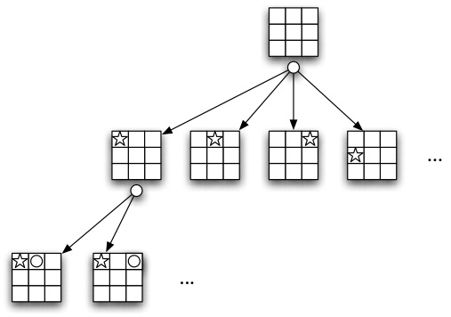

Figure 13. A segment of the game tree for tic-tac-toe

We define **minimax value** of a node as the utility for a player of a corresponding node, assuming that both players play optimally from that node to the end. The minimax value of a terminal state is that of its utility or heuristic function. Considering the options, MAX will prefer to move to a state of maximum value, while MIN will prefer one of minimum value. Informally,

The **minimax algorithm** calculates the most appropriate minimax decision for the current state. It is based on a recursive calculation of the minimax values for each successor of a node. The recursion advances towards the leaves of the tree and upon reaching these and calculating the utility function, these values return through the tree.

### Alpha-Beta Pruning

Minimax search has to examine a number of states that grows exponentially with the number of moves, although this circumstance can be reduced by at least half.

The technique used to reduce the tree is called pruning, and in the case of the minimax algorithm the so-called alpha-beta pruning is usually used, which when applied to a conventional minimax tree returns the same move that the algorithm would return without pruning.

The general idea of pruning is that there is no need to delve into how bad a possibility is. That is, if a variant is found that is worse than the worst that had been detected so far, it is not worth evaluating it. To delimit and maintain these values, two parameters (α and β) are used from which the method takes its name.

Since it is **not** the objective of this report to offer a detailed description of these algorithms, it is recommended to go to specialized bibliography. In particular it is interesting to consult [9] and [10].

### A First Idea

The most reasonable computation function known for hex is based on a method called **H-Search**, which allows us to generalize certain known patterns by extending them to the entire board. In this way, through the analysis of reduced environments, we can arrive at an assessment of a general environment. This algorithm was introduced by V. Anshelevich [1], the author of most of the existing documentation on this topic.

The general idea of this method consists in that a move will be more or less good depending on **whether it minimizes the distance of a player between the edges** and tries to maximize this distance for the opponent. The difficulty lies in the fact that, although there is no solid connection between two cells, they can form an implicit connection, which is just as strong, so we have to take these structures into account very much in our design. The central idea consists in the program being able to detect connections and combine them to simplify them.

In order to estimate this distance we must first calculate the **virtual distance** that separates the edges of each player. We will say that it is a virtual distance because it does not correspond exactly to the visible distance on the board, but is derived from the underlying state of the game: thus, there may be a connection of a player that is impossible to avoid. Although this connection is not physically closed, it is implicitly so, so we can consider that there is a null distance between the edges. We can define virtual distance as the distance between the edges of a player taking into account the established virtual connections.

Thus, to obtain a value of this distance, we must first define on a board representation the connections that reflect the true situation of the game, creating certain additional links. To obtain this representation the two AND and OR rules that we will see in the following section are very useful.

### Deduction Rules

These links are created by applying two deduction rules of recursive origin, the AND rule and the OR rule. These rules allow building complex virtual connections starting from simpler ones, constituting an algebra for virtual connections.

Always from the point of view of black, these rules are stated as follows:

**The AND Rule**

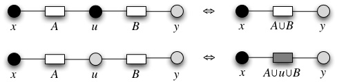

Figure 14. Diagram of the AND rule

Let the subgames (x, A, u) and (u, B, y) be two virtual connections with a common endpoint at u and two different ones x and y such that x ≠ y. We assume that x ∉ B, y ∉ A, A∩B = ∅.

If u is black, then the subgame (x, A ∪ B, y) is a virtual connection.

If u is empty, then the subgame (x, A ∪ u ∪ B, y) is a virtual semi-connection.

Put another more informal way, two virtual connections with a common endpoint are equivalent to extending said connection to another that includes those belonging to both connections. If this common endpoint is a black cell, both virtual connections in turn form a virtual connection with this cell, so it is a strict virtual connection. Otherwise, the white player can play on this union cell and prevent the connection, so it will simply be a virtual semi-connection.

**The OR Rule**

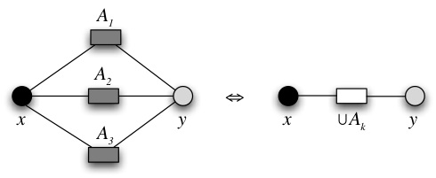

Let several subgames (x, Ak, y), with k = 1, 2, 3, ..., n (for n > 1) with common endpoints and that are virtual semi-connections. If the intersection of all paths Ak is empty, the subgame (x, A, y), in which A is the union of all Ak, forms a virtual connection.

Put another way, if between two cells there are two or more virtual semi-connections, then we can affirm that there is a virtual connection between them. This is so because if the white player intercepts one virtual semi-connection, black can secure the one that has been left free.

By combining the OR rule and the AND rule we can simplify the game, in a reverse hierarchy order, as shown in the figure:

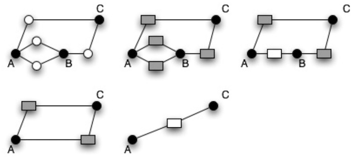

Figure 16. A deduction between A and C

### Discovering Connections with H-Search

Despite the conceptual simplicity of the AND and OR rules, the search for connections and cells that verify said rules is by no means trivial. The H-Search algorithm allows applying to cells and connection lists a series of operations that allow us to deduce new implicit connections. These new connections should be reflected in the graph by adding new links between cells.

The H-Search algorithm is based on the equivalence of some complex positions to simpler ones, or what is the same: how complex connections are built through simpler ones. Precisely this hierarchical idea is what gives the algorithm its name H-Search, abbreviation of "Hierarchical Search."

The H-Search algorithm is not another version of the usual tree search for games. H-Search and tree search use different representations of the problem and, as a result, search in different spaces. In particular, H-Search searches for virtual connections in the set of subgames of a hex position.

This brings us to another question: is the set of AND and OR rules complete? That is, can the H-Search algorithm build all virtual connections starting from the simplest ones? The answer is no, and there are examples of virtual connections that cannot be built through this procedure.

It must be said, however, that the AND and OR rules can be generalized to convert them into complete rules. However, generalized H-Search has not been tested with good results and its practical value is not yet clear. The H-Search algorithm is implemented in Hexy and in Six. Both programs are really strong and have won various competitions.

Serving as a preview, a detailed analysis of how this process is carried out will be offered later.

### Evaluation Function and Electric Circuits

Once the relationships have been established (discovered through H-Search) and represented on a graph, which is really a simplified board, an algorithm must be executed on it that calculates the global distance between edges of the same color. We will refer to these resistances as RN (for black) and RB (for white).

The calculation of this distance is equivalent to solving the **equivalent electrical resistance** in a circuit obtained from the graph [13], replacing the edges with electrical links with a variable resistance (resistors). The value of these resistances is the same as that of the graph edges. This idea, of great beauty, was first implemented by Shannon [14]. The idea, for the case of black, is shown as follows:

Figure 17. Circuit or board?

The calculation of edge values is calculated as a function of vertices. Thus, each vertex c takes a pair of values rb(c) and rn(c). Each parameter can take three different values, namely:

$$
r_b(c)=
\begin{cases}
1 & \text{if } c \text{ is empty} \\
0 & \text{if } c \text{ is occupied by white} \\
\infty & \text{if } c \text{ is occupied by black}
\end{cases}
$$

$$
r_n(c)=
\begin{cases}
1 & \text{if } c \text{ is empty} \\
0 & \text{if } c \text{ is occupied by black} \\
\infty & \text{if } c \text{ is occupied by white}
\end{cases}
$$

For each pair of neighboring vertices (let \(c_1\) and \(c_2\)), the edge that joins them has:

$$
r_b(c_1,c_2)=r_b(c_1)+r_b(c_2)
$$

$$
r_n(c_1,c_2)=r_n(c_1)+r_n(c_2)
$$

When the value of a vertex is modified (which can only happen once throughout the game) the values of the edges surrounding it must be recalculated.

With the appropriate resistance data, we must define a graph that represents an electric circuit. For this, we will add a conductor between two cells x and y if they form a virtual connection, in the same way as if they were neighboring cells.

Once this similarity is established, calculating the global distance between edges is equivalent to calculating the equivalent resistance of the circuit, solving its associated matrix by a conventional **iteration method**. This distance, contrasted with that of the opponent, gives us a numerical value of the quality of the move, which is obtained through the expression:

$$
E=\log\!\left(\frac{R_{N}}{R_{B}}\right)
$$

Another reasonable measure is the length of the shortest path in the graph connecting the edges, although using resistance in the equivalent circuit gives a more precise calculation, taking into account intersections and the different paths that connect the edges.

In the constructed system, the E function is somewhat different, following the idea of an earlier article [11] by V. Anshelevich. Specifically, taking into account that higher values represent an advantage for black and lower ones for white:

$$
E=\frac{R_{B}}{R_{N}}
$$

Thus, if black's resistance RN is null, it means that they have a VC between their board edges, with which in theory they will have won the game. The value of that move, then, will be infinite.

In the case of white, if they have a winning connection the value of RB will be equal to zero, and the overall value of the move also zero. The value of E for the implemented system varies in the interval [0, ∞)

In other games, when testing a move in the heuristic, it is checked whether that move leads to a victory condition through the terminal test. Thus, if in a chess game we have a move that leads to *checkmate* in our favor, we will execute it without further ado. However, in hex this is not entirely true, and consequently the heuristic does not rely on the terminal test at any time, as it is hardly useful. Instead, the move is considered winning simply if it leads to a winning virtual connection. The rest of the game will simply consist of specifying this connection and not allowing the adversary to interpose in it.

## Finding the Best Move

Through the previous procedures a numerical value is obtained of how good or bad a move is. Once these concepts have been introduced, we will see how they relate to each other to get the system to return the best available move.

It should be noted that not all game situations can be represented using the game hierarchy and the application of AND and OR rules, as it is not a complete set. This implies that the decision of the next move must be based on various additional data that need to be taken into account.

Thus, the general procedure that leads us to the move that the system will execute is as follows:

Generate a minimax search tree with possible moves and responses to them up to a variable depth. Apply, if appropriate, alpha-beta pruning to the tree branches to expedite the process. For each move to be evaluated, steps 2 and 3 must be executed for both players.

Obtain the equivalent virtual connections and semi-connections for each generated board, through the application of the H-Search algorithm.

Solve the electric circuit associated with the connections discovered in the previous step and obtain the value of the equivalent resistance.

The truly interesting part is that which corresponds to points 2 and 3, and therefore we are going to detail them in the following section.

### Calculate the Value of a Move

To calculate the value of a given move, it must be simulated on the game board. The system will create a Simulation object for each move to be simulated, and thus be able to trace the changes made to common structures.

**Applying the H-Search Algorithm**

When a simulation is generated to analyze a move, it is inserted on the board and it is studied whether it is surrounded by cells of the same color. This is so because several cells together of the same player can be simplified in the internal graph by the same one, as long as we preserve the connections.

A copy of the board is inherited from the previous move, on which all changes are executed. This copy contains the initial virtual connections of the board: that is, between adjacent cells there is a connection with a null path (immediate). A record of some changes is kept to undo them, since some structures are too complex to copy.

Let us consider any initial set of virtual connections and virtual semi-connections as the first generation of VC and SVC. In particular, this initial set can consist of the simplest virtual connections, such as all pairs of neighboring cells on the board. By applying the AND rule and the OR rule to the appropriate groups of this first generation of VC and SVC, we will obtain a second generation. Then we will apply the AND and OR deduction rules again to the first and second generation to build the third generation of VC and SVC. This process ends when no new virtual connections appear or a winning connection is found.

In practice, and due to the limitation of computational resources, H-Search is only able to discover winning virtual connections on small boards or in endgames. However, in the rest of the situations very descriptive approximations of the board situation and force balance are achieved.

**Solving the Electric Circuit**

In principle, and according to existing documentation on the subject, with the connections obtained from the application of H-Search, an electric circuit must be obtained that represents the board situation. Then, the matrix for this circuit must be generated and solved using an iteration method or similar.

However, this method can be extremely simplified by making the following considerations:

It was previously established that the resistance of a cell occupied by the opponent is r = ∞. If we have a branch N between node A and B, and rA= ∞ or rB = ∞, then we know that rN = rA + rB = ∞. In an electric circuit if the resistance is infinite, the current flowing through that branch is null, so we can discard in our calculations all branches adjacent to nodes that represent cells occupied by the opponent.

The abstraction of the electric circuit is useful for an intuitive reason. However, from the circuit we are only interested in its resistance matrix, which is what serves us to solve its equation. According to this, we can omit the construction of the circuit and directly develop its matrix.

Thus, we traverse a set of cells where the player being evaluated's own cells are inserted. For each cell we will obtain the state of its neighbors, and according to this state we will load the corresponding index of the matrix with its value. Once the matrix is finished, it is solved using the Gauss Pivot method.

The value obtained is the equivalent resistance of the circuit, and the value of the given position for the studied player.

### Pseudocode

The procedure described above is detailed below in the form of pseudocode. Said procedure will be described in depth in the design annexes of the constructed software system.

	Class Simulation

	Constructor (target cell of simulation)
	If there are neighbors of the same color to the cell that has just been inserted
		merge them into one
		store the eliminated cells and original connections

	Procedure: Calculate move value: double
		White resistance = Calculate resistance (white)
		Black resistance = Calculate resistance (black)
		Return (White resistance / Black resistance)

	Procedure: Apply OR Rule (sets)
		If these new sets have formed SVC
		update and create a VC.

	Procedure: Calculate resistance (color)
		Note the following paths to expire
		G = Generate set G for color
		C = Generate a list for virtual connections
		SC = Generate a list for virtual semi-connections

	While at least one new VC is created:
		Take a cell as pivot and two others as auxiliary.
		Whenever there is a newly discovered connection:
			If the pivot is of color: by the AND rule, there is a VC between the two auxiliaries that involves the pivot
			If not: by the AND rule, there is an SVC between the two auxiliaries that involves the pivot. If this SVC did not exist, then Apply OR Rule (sets resulting from applying the AND rule)

	With the discovered connections, generate the equivalent electric circuit
	Matrix = Generate a matrix representing the circuit
	Solve using Gauss pivot (Matrix)

### Conclusions

In this section, part of the precise methods for evaluating moves in hex have been introduced. In summary, the general idea consists in that a move is good for a player to the extent that it contributes to minimizing the distance between their edges, while maximizing the distance between the opponent's edges. This distance is obtained by calculating the resistance between the board edges when simulating an electric circuit on the most complete virtual connections that the algorithm has been able to discover. These connections are discovered through the application of the AND and OR rules.

At the beginning of this section it was warned that hex may seem like a simple game at first glance, a perception that is totally wrong. With implementation something similar happens: the apparent simplicity of structures soon exceeds the most optimistic forecasts, times begin to skyrocket and the algorithm capable of solving a small board in barely a second becomes extremely slow when moving to larger boards.

Hex is a demanding game in terms of implementation, as it requires complex structures and extensive operations. Even the board representation is potentially critical as it is so different from traditional games.

This is a game that begins by provoking disbelief and ends up obsessing whoever approaches it. For something it has fascinated some of the most outstanding minds of our time. Shannon, Moore, John Nash... although coming from different disciplines, all of them suffered throughout their lives the irrepressible attraction to this game, which I have the honor of sharing with them.

# Techniques and Tools

Below are some relevant design decisions with their corresponding justification.

## Object Orientation

From the outset, the object-oriented model was chosen, despite the highly structured nature of this type of problem. There is a certain loss of efficiency inherent to the concept of object orientation, which motivates having to seriously consider the paradigm that will be used in the development of applications such as a game, where times are an important factor.

In the "Relevant Aspects" section, in-depth assessments are made on the methodologies used in development.

## Prototyping

There are no previous experiences in the implementation of hex games on a language like Java and, therefore, there were very important doubts about its viability. Consequently, it was necessary to develop some preliminary prototypes to test the performance of the decision algorithms.

Mainly some versions of the H-Search algorithm and the structures required by it were built to execute some performance tests.

## Some Decisions

Below are some decisions made based on different alternatives, arguing the reasons for them:

### Programming Language

When choosing the programming language, the following requirements were established:

Be a **pure object-oriented** language.

Ability to develop **multiplatform** software without making too many changes, preferably none.

Support for **graphical user interface** design natively.

Allow possible integration on the **Internet**.

Existence of **free development tools** for the language.

Fast executables. It was important to maintain the highest possible **performance**.

Support **genericity**. This is necessary due to the numerous lists and complex structures that the software would maintain.

As alternatives, the languages C++, C# and Java were evaluated.

In principle, C++ allows transferring systems between platforms by making separate compilations, as long as operating system-specific functions are not used. The problem arises in the graphical interface, as possibly different versions would have had to be developed for each platform. In the case of C# there is the same problem, and even aggravated by the dependence on a single platform. Finally, the possibility of using technologies such as applets, servlets or Java Web Start tipped the scales towards the Java language, at the price of sacrificing some speed.

### Mathematics Library

The system requires certain common functions, such as solving equation systems of a certain magnitude. To perform these activities, it was initially thought to use **JScience**, a specific library for scientific applications in Java.

JScience is a very interesting and very complete solution, with support for genericity, but it was estimated that it was not very reasonable to link such a large library to use a minimal part, so manual construction of said modules was chosen.

***JScience***

JScience website. Last visited: June 5, 2007.

http://jscience.org

### Applets or Servlets?

This question arose shortly after starting the project, and suggested interesting possibilities, allowing the system to run through the Internet.

Thanks to Java's flexibility, it was decided to postpone the decision and begin developing a desktop application that in the future could run as an applet or servlet. Finally this point was discarded, since several simultaneous accesses to an application with high resource consumption could cause problems on the server.

## Development Tools

Below are the tools used for system development.

### Development Environment

Practically all of the system has been developed on the NetBeans 5.0 and 5.5 IDE, developed by Sun Microsystems on the Mac OS X system. For some parts and initial adaptations, the Xcode IDE, developed by Apple Inc., was used.

For most of the development, NetBeans was preferred because of the ease of designing graphical interfaces in this environment, although finally these features were not used for efficiency reasons.

### Planning

For planning, the two most popular tools for Mac OS were evaluated: xTime and Merlin. Finally Merlin was preferred for offering more ease of use and fewer restrictions in its free version than xTime. Merlin is quite more agile for relatively small projects or with few agents, and the experience with this application is very satisfactory.

***Mac Project planning software***

In this article (in English) very useful information was found about this type of applications for Mac OS environments. Last visited: June 4, 2007.

http://www.anyware.co.uk/2005/2006/03/23/mac-project-planning-software

### Requirements Elicitation

For the requirements phase, the REM tool, from the University of Seville, was used, which allows managing the generated information and presenting it appropriately with relative simplicity.

### CASE Tools

For modeling, the MagicDraw UML application was chosen, of which a free evaluation version is available that adapts to project requirements. This alternative is found to be far superior to the rest of available CASE tools.

### Graphic Design

For the design of graphical interface sketches and for some diagrams, the OmniGraffle Professional application was used, with a very positive experience.

Most of the images from the final application were generated with Macromedia Freehand MX, with The Gimp and with Seashore.

# Relevant Aspects

This section is a summary of the most interesting aspects of project development. The central part of it is the construction of a system, called **Hexodus**, which allows the user to face the computer in a hex game, based on the ideas presented above. Said application is the first multiplatform hex game, with the possibility of parallel execution and built using Java technology.

## Methodology

When beginning the planning of this project, two issues were faced: on the one hand, the prior existence of a class library for hex written in C++ as part of a previous work [8]. On the other hand, the development characteristics made it desirable to make rapid development and some tests with the heuristic engine before addressing development in its full dimension.

### Reuse

Part of the code and documentation was recovered from a class library designed as part of the Object-Oriented Programming course practice during the 2005 – 2006 academic year [8].

The library consists of a package of classes written in C++ to support the simple implementation of programs to play hex, although evidently it was **not** capable of playing against the user and only allowed two-player mode. However, the functional core that could support prototyping was already built.

The processes and documentation of this library were also available, so part of the prototype could be developed very quickly, through a review of the system models. It was necessary to do preliminary work to translate the code to Java and correct a certain number of detected errors.

### Prototyping

The objective of prototyping was to build an early module that would allow testing the operation and adaptation of the connection detection algorithms that appear in the documentation. This implementation constituted an important risk factor in development.

Before beginning prototyping, the analysis and design models of the reused part were expanded to accommodate the new classes. By applying different patterns, it was determined which part of the model the prototyped module would occupy and a draft of the requirements it should meet was designed.

This model would in the future be in connection with the rest of the game, so interfaces were designed to make this communication, with their corresponding interaction models.

The elaboration of the prototype lasted for a relatively long time due to the complexity of the algorithms, so a significant part of the development effort was invested in this process.

### Validation

Upon validating the prototype, we proceeded to trace the changes made to the structures to make them coherent with existing development models. The rest of the process, specifically the interface design and the connection of different modules, was carried out according to an **adaptation** of the Unified Process (UP), as described below.

### An Adaptation of the Unified Process

The Unified Process is an iterative and incremental development process composed of four phases called Inception, Elaboration, Construction and Transition, where each of these phases is in turn divided into a series of iterations, which result in an increment of the developed product that adds or improves the functionalities of the system under development.

The Unified Process is built on four pillars:

Driven by use cases, whose application is used to discover the necessary structures of the system.

- Iterative and incremental.

- Centered on architecture.

- Focused on risks

The developed system has been built according to these four principles, giving special relevance to use cases as process drivers, refining systems individually in iterations and adding new ones in successive increments.

The presence of a reused module and the need to carry out prototyping, as explained above, decisively influenced the procedures carried out during development. The synergistic sum of object orientation and the concept of the iterative and incremental process was vital in the management of evolutionary prototyping and very notably favored the reuse of already built modules and their associated artifacts.

## Modularity

The basic conception of the system is based on two large packages: one dedicated to game management and another dedicated to finding the best moves when the computer intervenes in the game. This is interesting because it implies the existence of two completely independent systems that can be considered two separate class libraries:

The base game system with its logical rules, which allows its extraction and integration in the development of other hex games.

The *intelligence* engine of the program, which can be used independently in other systems, simply respecting the interfaces.

The idea is to be able to use these subsystems in other contexts with little development effort, simply by modifying the user interface. To reinforce this concept of independence, both modules are packaged separately.

Thanks to this design, utilities related to the game have been developed, such as the auxiliary application **Hextress**, which is described in the next section.

## Parallel Processing

Parallel processing systems offer very interesting possibilities in the treatment of this type of problem. In principle, the construction of a multi-threaded system was ruled out so as not to complicate the design, although finally it was decided to include it in some tests, which yielded very positive results.

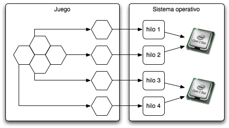

Figure 18. Distributing cells among processors for a 2x2 board

In this scheme, each cell is associated with a simulation. For each simulation a thread is created that processes it and returns the result of playing in that cell to the main procedure, which chooses the best option. The Java virtual machine automatically distributes threads among the system's available processors, if it were equipped with more than one.

This performance improvement meant that parallel processing was included as part of the system. However, this circumstance was not foreseen when the decision algorithms were designed and tested, so the changes made for the program to support multiple threads entail certain penalties in memory and processor consumption. Specifically, in the current system, applying parallel processing:

1. The first level of alpha-beta pruning of the move tree is lost.
2. Object copies are multiplied to keep the process coherent.

This results in that if the system runs on equipment with more than one processor, performance increases, as the increase in operations speed compensates for the previous two penalties. However, if this version of the algorithm runs on a single-processor machine, performance degrades very notably.

To solve this problem, it was decided to design two subsystems: one multi-threaded, aimed at multi-processor machines, and another multi-threaded aimed at machines with one processor. The latest versions of the Java virtual machine automatically compensate for parallel processing among the machine's different processors.

This has the advantage that changes for multi-threading do not penalize execution when a single processor is used, and if several are available, CPU time is maximized. The system detects the machine's configuration and according to it, decides whether it should use procedures for one or several processors. This is possible thanks to the implementation of the factory pattern in the polymorphic construction of heuristic objects.

To reach this design it was necessary to carry out a small study based on the performance of different systems for the two versions of the algorithm, as described below.

### Practical Study

Testing the application with several users, on several computers and obtaining reliable results from its execution is a complicated task in this case, since very few people still know how to play hex. Doing performance tests is complex due to the large number of available games and how much the result varies in each game. Thus, for example, the program needs less time to calculate its response to a weak move than to respond to a good move, so the results of executions are too variable when the human hand intervenes.

The system design makes it very simple to create new applications and tools based on the game, so it was decided to create a specific application for the tests. This application, called **Hextress**, only has a window where it shows the result of a certain number of previously configured tests.

Hextress only has one window, where it shows the number of processors detected in the system and the test results in seconds, hiding the details of its behavior.

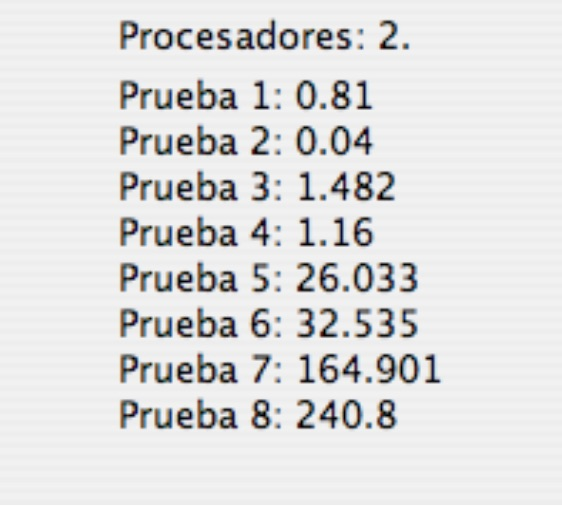

Figure 19. Hextress showing results

The tests performed are identified according to the following table:

| Test | Board | Algorithm executed |
|:-----:|:-------:|---------------------|
| 1 | 3 | Parallel    |
| 2 | 3 | Sequential  |
| 3 | 4 | Parallel    |
| 4 | 4 | Sequential  |
| 5 | 5 | Parallel    |
| 6 | 5 | Sequential  |
| 7 | 6 | Parallel    |
| 8 | 6 | Sequential  |

These tests consist of letting the system play against itself for certain boards, alternating the application of the sequential algorithm with the parallel one. The idea is for the system to execute the same operations in sequential and parallel mode and time them. With the resulting times, reliable measures of processing times are obtained for each option, and the different execution options can be compared more easily.

According to the previous table, typical tests suppose the execution of demonstration mode on boards of dimension 3, 4, 5 and 6, alternating the sequential and parallel versions of the algorithm. Larger boards can be used in the tests, but processing times are high, and the aim was for the program to be able to run quickly and not commit the user for more than five minutes.

By performing the tests both on equipment with several processors and on equipment with only one we can conclude which version of the algorithm is more efficient in principle for each hardware configuration, and it will allow us to provide evidence and concrete times that justify the system design. It is about answering the question: does the additional expense in operations and memory consumption of the parallel version of the algorithm justify providing better processing times? The answer, as explained in the following section, is affirmative.

**Description of Equipment**

Below are the configurations of the equipment that participated in the case study, indicating the number of processors of each of them. Systems shaded in gray have a single processor, and their results serve to contrast the rest.

| Id. | Processors | Model              | Frequency (GHz) | Memory (MB) | Operating system |
|:---:|:--:|---------------------|:----------------:|:------------:|-------------------|
| 1   | 2  | Intel Core 2 Duo    | 2                | 1024         | Mac OS 10.4.9     |
| 2   | 2  | Intel Core Duo      | 1.83             | 1024         | Mac OS 10.4.9     |
| 3   | 2  | Intel Core 2 Duo    | 2.33             | 2048         | Mac OS 10.4.10    |
| 4   | 4  | Intel Xeon          | 2.66             | 2048         | Mac OS 10.4.9     |
| 5   | 1  | Intel Centrino      | 2                | 1024         | Windows XP SP 2   |
| 6   | 2  | Intel Core Duo      | 2                | 1024         | Mac OS 10.4.10    |
| 7   | 2  | Intel Core Duo      | 2                | 2048         | Mac OS 10.4.10    |
| 8   | 2  | Intel Core Duo      | 1.83             | 1024         | Windows XP SP 2   |
| 9   | 2  | Intel Core 2 Duo    | 1.86             | 2048         | Windows XP SP 2   |
| 10  | 1  | AMD Athlon XP-M     | 1.2              | 256          | Windows XP SP 2   |

**Results**

In Appendix A, at the end of the report, the data sheets with the results of the experiences carried out properly classified are attached. They can also be consulted in spreadsheet format in the digital support that accompanies this report.

Below are a series of graphs that relate the processing time of a complete game to the size of the board of the game in question. Lower times imply better system performance.

For single-processor systems (equipped with a single microprocessor):

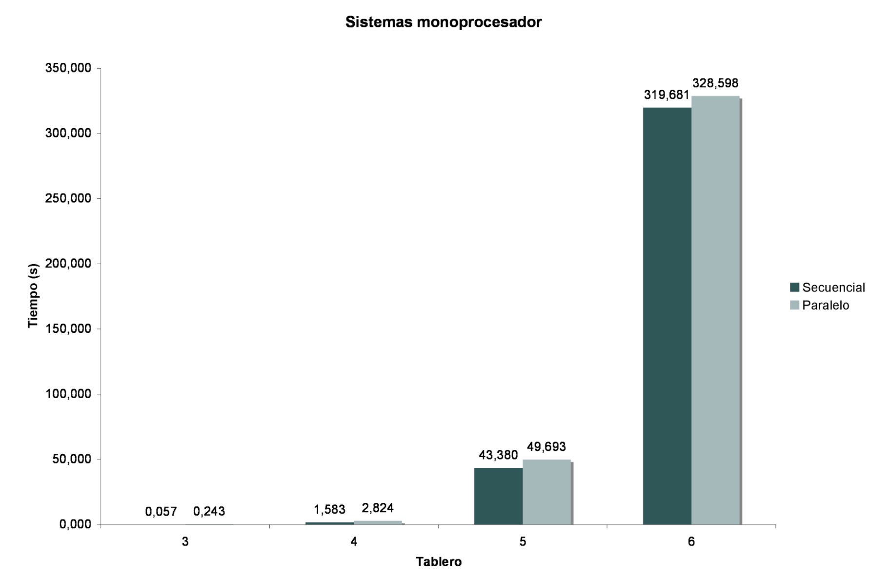

Figure 20. Time graph for single-processor systems

Slightly better performance is observed for the sequential algorithm than the parallel one, whose differences tend to increase as the board size increases. Most of the tests were performed with two-processor or two-core equipment, with the following results (averages):

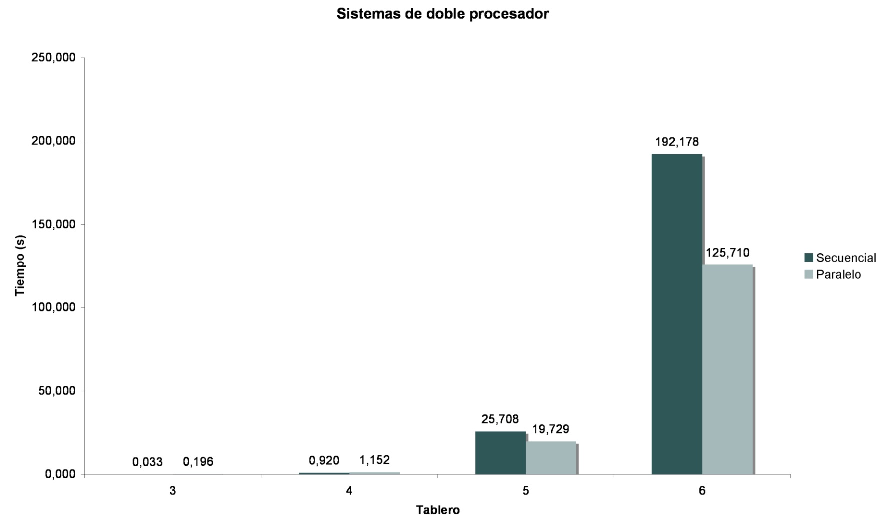

Figure 21. Time table for two-processor systems

A very significant improvement in times for medium boards is observed when using the parallel algorithm. Finally, for four-processor systems, the following results were obtained:

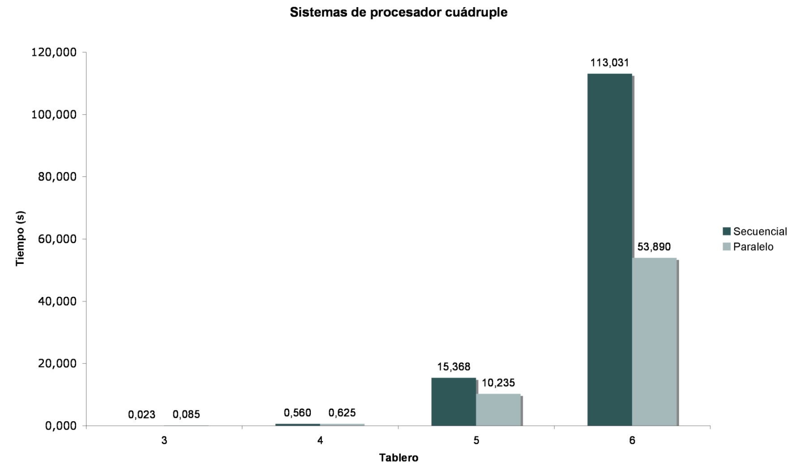

Figure 22. Time table for four-processor systems

### Conclusions

The data collected in the various tests allow us to draw certain interesting conclusions. First, for small boards, of dimension less than or equal to 4, better performance is observed for sequential algorithms in all cases. This benefit margin is very wide in dimension 3 and somewhat narrower for dimension 4. From dimension 5 onwards, only on single-processor equipment are better performances obtained in the sequential version.

This better performance of the sequential algorithm for small boards even on multi-processor equipment is better appreciated in the following diagram, whose vertical axis uses logarithmic scale to exaggerate differences:

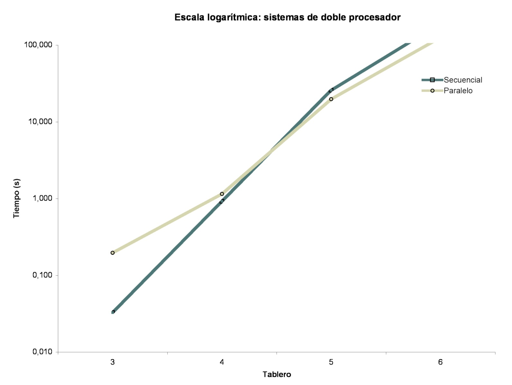

Figure 23. Logarithmic scale for dual systems

If the computer has more than one processor, on medium boards (of dimension 5 and 6) better performances are appreciated in parallel algorithms. On the other hand, if the computer only has a single processor, medium boards follow the progression of small ones, and higher costs are observed for parallel processing than for sequential. The latter is so because multi-threaded execution requires more operations and more memory work, so its use only pays off when more than one processor is available to expedite execution.

In synthesis, it can be concluded that the parallel algorithm is optimal for multiprocessor environments, so the additional processor and memory expense is compensated thanks to concurrent execution, while the sequential algorithm is more efficient for equipment based on a single processor. In a broader sense, we can consider that building less efficient algorithms can be profitable if in exchange we can use the system's parallel processing capabilities.

This conclusion has been used as a basis for the implementation of the automatic parallel processing capabilities that have been discussed in this section: depending on the system characteristics, the sequential or concurrent version is applied through the use of polymorphism.

### Other Evaluated Possibilities

**Overlapped Processing**

When the possibility of creating a multi-threaded version was evaluated, the possibility of starting to evaluate a move while operations with the previous one were being completed was also considered. Finally it was discarded because this option was not practical nor did it adapt to the system characteristics.

**Thread Number Restriction**

To reduce system load, a version was implemented that maintained only two threads running at a time, leaving the rest in a queue. Although in principle this option could seem interesting, the expense of waiting for each pair of processes before launching two others greatly penalized execution times, so it was discarded.

## Multiplatform

One of the objectives set in the previous phases is that the application can run on the most widespread operating systems (Linux, Windows and Mac OS). The Java technology, used in this project, allows code execution on a virtual machine. This allows generating intermediate code that is then interpreted by specific "adapters" of each system without it being necessary to perform a separate compilation.

The application components have been developed so that adequate integration on all systems is possible.

## Structure Efficiency

Below are some decisions made around the data structures used, a vital part of this project.

### Hash Maps

Java has structures called HashMap that are a table based on a hash key. The advantage of these structures is that they allow us to relate objects with arrays of other objects. That is, create arrays whose index is an object.

The H-Search algorithm is based on creating cell paths between two cells, which in principle recommends this implementation. However, to support the scheme, it was necessary to create an extension of HashMap, adapted to use two indexes instead of one. The following figure shows an approximation of this idea.

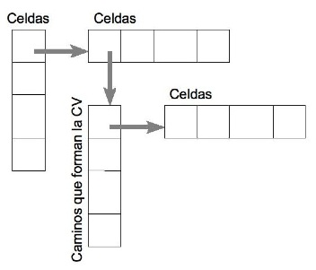

Figure 24. A somewhat complicated diagram

However, the cost of operations is very high, as HashMap occupies a lot of space in memory and accesses are slow for a certain number of elements.

Another option considered was to represent the paths between two cells as a logical bitmap of three dimensions. However, this option had to be discarded because certain additional operations are necessary in path containers, which in turn require other operations and other special attributes.

HashMaps need to have a value that can serve as a unique identifier for each element they index, if you want operations to be fast. Thus, it is necessary to provide each cell object with an identifier. However, if each object has a unique integer identifier, this identifier can be used as an index in a table. Then by proposing a table of references to path containers (called "routes"), the same functionality as HashMap can be provided in times less than 40%, according to tests performed.

How to assign an identifier to each cell? Each cell is identified in principle by the row and column in the case of cells, and by the cardinal point it represents in the case of edges. Thus, for the case of cells:

And in the case of edges, they are assigned from the last identifier occupied by cells in increasing order, according to north, south, east and west.

### Lists and Vectors

Java has a type of structure called ArrayList, which is an abstract list where objects can be stored in order, retrieved and operations executed very quickly. The algorithms are very optimal, although efficiency is lost relative to traditional arrays when operations such as traversing indexes are performed.

Thus, in parts where these structures could be dispensed with with little additional coding, this has been done. In other parts it is simply not viable due to the number of insertions and deletions of elements. In some of these cases the toArray() function has been used, which converts the list into a conventional array, which can be traversed and accessed more quickly.

## Move Simulation

The system uses a somewhat novel system by identifying each move to be tested with a simulation. This allows keeping control of simulated moves, the order they occupy in the game, the structures they affected to undo changes... This control allows reusing between calls to simulations part of the structures from the previous simulation, undoing changes appropriately.

## Cell Simplification

A set of neighboring cells occupied by the same player can be considered as one. From the point of view of the game this is not strictly true, but it is from the point of view of the heuristic. Although it may seem very intuitive, simplifying cells is a certainly complicated task, especially because the trace of changes made must be stored to revert them when undoing simulations, it being necessary to observe a multitude of exceptions and different circumstances when performing these operations.

The main idea is that, for example, given this situation:

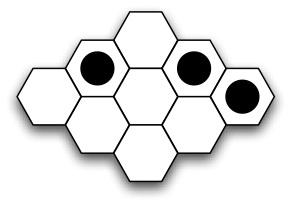

Figure 25. A position on the board

If we represent the previous board as a graph, we would have:

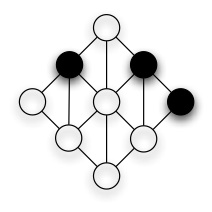

Figure 26. The graph equivalent

And taking into account that two neighboring cells can be considered as one, this would be equivalent to:

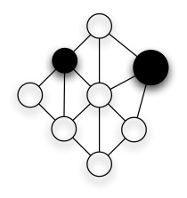

Figure 27. Simplifying cells

There are situations where very significant benefit can be obtained from this property, the following figure serves as an example:

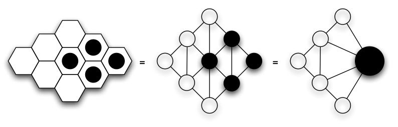

Figure 28. Eliminating three cells

Simplifying cells reduces the number of cells that must be evaluated, and consequently increases the efficiency of algorithms.

In practice, when occupying a board cell in the simulation of a move, a reference to the cell that has been eliminated is saved, and it is replaced by the new one. Immediately afterward, the references of the neighbors of the replaced cell are copied into the new one, as long as they did not previously exist.

When the simulation is undone, the eliminated cell is reincorporated into the board and connections are restored.

## Other Interesting Aspects

### Different Game Modes

The system allows executing the game in different modes. Thus, for each new game the options are offered:

Play a human against the computer, being able to configure which player will start moving.

Play a human against another human, disabling the automatic response for this mode, and allowing both contenders to face the program acting as referee.

Demonstration mode. This mode allows observing the computer playing against itself, which is interesting for the purpose of studying the quality of the heuristic.

In the first two modes, the system has the option of suggesting the best move according to its criteria. The player who receives the suggestion can accept it or execute another move of their choice.

### Suggesting Moves

The player in possession of the turn can request that the system suggest what, in its judgment, is the best move. The move appears marked on the board and the user can accept it or execute another move of their choice.

### Swap Rule

The system allows, when creating a game, activating or deactivating the swap rule. This allows the player to decide whether to swap the first move, whether it was generated by the computer or by another human.

If they do not wish to swap the move, the second player can execute any other on the same board.

### Opening Tables

The first move is generated through a static table that contains the best moves, differentiating the case where the swap rule is activated or not. With current characteristics, the system always plays in the center cell if the swap rule is deactivated. Otherwise, it executes a good move that is less tempting for the opponent, so that they do not swap it but at the same time can maintain a certain advantage.

### Configurable Game Level

The system allows configuring the heuristic game level when creating a new game and during the course of them. The level selection translates internally into a greater or lesser depth of the search tree and detail of searches. In the application, the user can configure the level between "normal mode" and "expert mode." Normal mode works with a height in the search tree of 2 and expert mode with 3. These values provide very good results. Expert mode is useful for endgames and small boards where there are certain subtleties that normal mode does not detect.

### Graphical User Interface

It is estimated that more than 90% of prototyping and development tests were done in text mode, minimizing dependence on the graphical interface. Its implementation has been carried out respecting the independence of modules as much as possible, so that the internal logic of the program is independent. This will allow, when the time comes, using the decision engine on another interface, or implementing it on a game server that has its own graphical front end.

Special attention has been paid to the design of the graphics of the game's main screen to achieve an attractive, simple and as intuitive as possible environment.

## Difficulties

Throughout this development, multitudes of problems and difficulties have arisen. The overall result is the result of a continuous exercise of providing solutions and contrasting alternatives.

The first difficulty was the lack of documentation on the game. This situation has been correcting itself over time, although there is still a long way to go. To the lack of references on the game is added the lack of explicit documentation on implementation of programs capable of playing hex. While there are, due to computing tradition itself, countless studies on chess or checkers, which clearly expose how to design good heuristics and even examples, there is hardly anything available on hex, beyond the two or three articles we have referred to.

In the initial study, complexity management was reflected as critical. However, division into modules, the object-oriented paradigm itself and Java tools, have reduced this problem to the anecdotal.

# Conclusions

Tree-based search methods are widely used in computer games and are treated in detail in most of the bibliography on Artificial Intelligence (AI). However, it should be noted that strictly, these methods have little or nothing of AI, but are rather deterministic mathematical methods that simulate a human way of proceeding, although formalized for the case of machines.

The most interesting advances in the field of games come precisely in the application of AI techniques in game resolution. Such techniques have been successfully implemented in the **Blondie24** program, which uses an artificial neural network to play checkers, surpassing the best human players. In fact it has been a long time since computers have been allowed to compete against humans in checkers tournaments.

Hex is a game with a nature very linked to mathematics, and a beautiful example of how simple structures can be combined and give rise to complex systems. The greatest difficulty when we face the computation of this game is, precisely, eliminating its superficial mask of entertainment and entering its overflowing underlying logic.

The idea that has allowed computers to play hex escapes the field of games and artificial intelligence itself to root itself solidly in mathematics. Unlike most computable abstract games, the methods that allow us to choose the best move in hex are not based on utilities or cell values, but on the study of graphs that describe the game at an internal level, in full understanding with mathematics. Engineering and its more practical sense mix in the magical idea of treating connections in these graphs as electric circuits, and allows making the complicated dream of playing hex against a machine possible.

The key idea is **union**. From computer architecture, graphical interfaces, object orientation or the lowest level structures of computer engineering; to game theory, graphs or the algebra of equations in mathematics, passing through circuit theory in physics... all disciplines come together and work in synchrony in the complex task of finding the best move in a game that is learned in a few seconds.

## Future Lines of Work

As in most of this type of project, so open to improvements and changes, it is easy for the system to never be finished. Among the most interesting ideas for future versions are:

Continue obtaining data on parallel processing that allows its comparison with later versions.

The possibility of adding a learning system based on artificial neural networks, which would allow the system to evolve over time.

Study the possibility of implementing a distributed computing system among several computers.

Study how some structures can be reduced to a lower level to improve performance.

Formalize communication protocols with other programs. It is possible that an effort will be made to lead the developer community's effort to reach consensus on the definition of a protocol that allows applications to communicate and play with each other.

Regarding minor issues, more related to software functions, the following stand out:

Undo and redo move functions, allowing advancing and retreating through move history. In hex implementing this feature is by no means trivial, and in fact most programs do not include it.

More speed in move decision. It would be necessary to study the algorithms and see how certain calculations can be reused.

Allow saving and opening games. It would be interesting to use an XML format for this feature.

Provide for the interface to be displayed in the system language, and allow generating translation files.

# Acknowledgments

This project began to take shape at the end of 2005. That this complicated journey has ended in safe harbor is the collective merit of many people.

**René Reynaga** suggested the idea of studying this game in particular, provided his knowledge of it and countless interesting concepts from which this project has been nourished.

**Luis Alonso Romero** provided very valuable bibliography and references on Artificial Intelligence and was of great help throughout this long project.

**Rafael García–Bermejo** provided very interesting ideas such as the possibility of performing multi-threaded processing and the optimization of some structures to shorten execution times. Likewise, he attended to my inquiries with excellent disposition and enormous patience.

**Eduardo Alberto de la Peña** became for a few days an authentic virtual tutor providing a very interesting method to calculate the resistance of electric circuits.

**Eladio Sanz** and **Marcelino Zazo** collaborated with excellent disposition in the study of algorithms that would allow generalizing the resolution of electric circuits.

**Carlos Polo** is the co-author of the first version of the class library for hex written in C++ [8] and which served as the basis for the realization of this project. In addition, he was willing to discuss certain methodological aspects and provided his valuable opinions.

**Marián Torrecilla** obtained time from where there was none to review and correct a good part of the report providing interesting comments and annotations.

## Beta Testers

The following people collaborated in the development of this system allowing, with excellent disposition, that the Hextress application be executed on their computers and sent back the execution results, allowing their tabulation and subsequent analysis. A good part of this work would not have been possible without them:

- Inés López
- Olga Molina
- Carlos Polo
- Pablo Ramos
- Roberto Sánchez
- Marián Torrecilla

# References

Below is a list of documentation referred to in the text:

- [1] Vadim V. Anshelevich. *A hierarchical approach to computer Hex*. **Artificial Intelligence**, 2001.
- [2] Edward A. Bender. *Mathematical Methods in Artificial Intelligence*. IEEE Computer Society Press, 1996.
- [3] S. Even; R. E. Tarjan. *A Combinatorial Problem Which is Complete in Polynomial Space*. **Journal of the ACM** 23, October 1976.
- [4] Stefan Reisch. *Hex ist PSPACE-vollständig*. **Acta Informatica** 15:167–191, 1981.
- [5] Jack van Rijswijck. *Computer Hex: Are Bees Better Than Fruitflies?* Master's thesis, University of Alberta, 2000.
- [6] Thomas Maarup. *Hex: Everything You Always Wanted to Know About Hex But Were Afraid to Ask*. University of Southern Denmark, 2005.
- [7] Oskar Morgenstern; John von Neumann. *The Theory of Games and Economic Behavior*. Princeton University Press, 1947.
- [8] C. Polo; P. Torrecilla. *Class library for hex*. University of Salamanca, 2006.
- [9] S. J. Russell; P. Norvig. *Artificial Intelligence. A Modern Approach*. Pearson Education, 2004.
- [10] Nils J. Nilsson. *Artificial Intelligence. A New Synthesis*. McGraw-Hill, 2001.
- [11] Vadim V. Anshelevich. *The Game of Hex. An Automatic Theorem Proving Approach to Game Programming*. **Artificial Intelligence**, 2000.
- [12] D. Gale. *The game of Hex and the Brouwer fixed-point theorem*. **American Mathematical Monthly** 86 (1979): 818–827.
- [13] Paul A. Tipler. *Physics for Science and Technology*. Reverté, 2001.
- [14] C.E. Shannon. *Computers and automata*, Proceedings of Institute of Radio Engineers 41 (1953) 1234–1241.

## Other Bibliography

Other bibliographic references consulted during the preparation of the project:

- [15] I. Jacobson, G. Booch, J. Rumbaugh*. The Unified Software Development Process*. Addison-Wesley, 2000.

- [16] I. Jacobson, G. Booch, J. Rumbaugh*. The Unified Modeling Language: Reference Manual*. Addison-Wesley, 2000.

- [17] A. Durán, B. Bernárdez*. Methodology for Requirements Elicitation of Software Systems*. University of Seville, 2002.

- [18] A. Durán, B. Bernárdez. *Methodology for Software Systems Requirements Analysis*. University of Seville, 2001.

- [19] Judy Bishop. *Java: Programming Fundamentals*. Addison-Wesley, 1999.

- [20] Bruce Eckel. *Thinking in Java*. Pearson Education, 2002.

## Internet Resources

Of all the references consulted, the most interesting are shown below. It has been considered convenient to show in each case a brief description of the referred site.

- Hexwiki. Wiki-type site with very detailed information about hex.
http://hexwiki.org [Last visited: June 25, 2007].
- Interactive Multipurpose Server. Website with a large amount of documentation
on mathematics and resources, such as applets for solving equation systems,
automatic tracing systems... http://wims.unice.fr [Last
visited: March 13, 2007].
- Wolfram MathWorld. Comprehensive website with multitudes of resources on
mathematics. http://mathworld.wolfram.com [Last visited: April 10,
2007].
- Numerical recipes. Collection of online books that address the computation of
different mathematical methods. http://www.nrbook.com [Last
visited: May 15, 2007].
- Numerical methods. Online book with information on numerical methods.
http://www.uv.es/~diaz/mn/fmn.html [Last visited: March 15, 2007].
- Computation course. Compilation of theoretical data on solving linear
equation systems. http://www.uv.es/~diaz/mn/fmn.html [Last
visited: March 10, 2007].
- Wikipedia. Free online encyclopedia (Used as a secondary source).
http://wikipedia.org [Last visited: June 17, 2007].
- Mac Project planning software. In this article (in English) very useful
information was found about this type of applications for Mac OS environments.
http://www.anyware.co.uk/2005/2006/03/23/mac-project-planning-software
[Last visited: June 4, 2007].
- JScience. Scientific library for Java. http://jscience.org [Last visited: June 5,
2007]
