**UNA APLICACIÓN PARA JUGAR AL HEX**

MEMORIA DEL PROYECTO

UNIVERSIDAD DE SALAMANCA

INGENIERÍA TÉCNICA EN INFORMÁTICA DE SISTEMAS

Salamanca, junio de 2007

# Tabla de contenidos

1 - Introducción

2 - Objetivos del proyecto

3 - Conceptos teóricos

4 - Técnicas y herramientas

5 - Aspectos relevantes

6 - Conclusiones

7 - Reconocimientos

8 - Referencias

# Tabla de figuras

Figura 1. Un tablero típico de hex	

Figura 2. Turno para las blancas	

Figura 3. Turno para las negras	

Figura 4. Una conexión implícita	

Figura 5. Una conexión explícita	

Figura 6. Una plantilla de borde	

Figura 7. Y otra plantilla de borde	

Figura 8. Plantilla para distancia 5 en tableros grandes	

Figura 9. Un muro. (Copyright © 2005 Thomas Maarup)	

Figura 10. Cortar el paso. (Copyright © 2005 Thomas Maarup)	

Figura 11. Tiempo frente a dimensión del tablero	

Figura 12. Diferentes conexiones y semiconexiones	

Figura 13. Un segmento del árbol de jugadas para el tres en raya	

Figura 14. Esquema de la regla AND	

Figura 15. Esquema de la regla OR	

Figura 16. Una deducción entre A y C	

Figura 17. ¿Circuito o tablero?	

Figura 18. Repartiendo casillas entre procesadores para un tablero de 2x2	

Figura 19. Hextress mostrando resultados	

Figura 20. Gráfico de tiempos para sistemas de un único procesador	

Figura 21. Tabla de tiempos para sistemas de dos procesadores	

Figura 22. Tabla de tiempos para sistemas de cuatro procesadores	

Figura 23. Escala logarítmica para sistemas duales	

Figura 24. Un esquema algo complicado	

Figura 25. Una posición en el tablero	

Figura 26. El equivalente en grafo	

Figura 27. Simplificando casillas	

Figura 28. Eliminando tres casillas	

# Introducción

El hex es un juego abstracto y de suma cero entre dos contrincantes. Se desarrolla sobre un tablero en forma de rombo compuesto por celdas hexagonales. Las fichas suelen ser de dos colores diferentes, asociado uno a cada oponente, tal como se muestra en la figura 1:

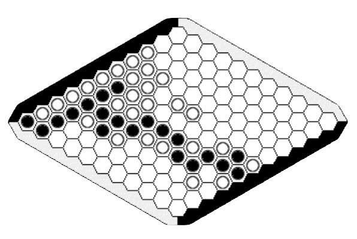

Figura 1. Un tablero típico de hex

Gana el jugador que primero forme una cadena de fichas de su color conectando los dos laterales opuestos del tablero. Estos laterales se asignan previamente a cada jugador y normalmente están marcados en su mismo color.

Inicialmente el tablero se encuentra vacío. A cada jugador se le asigna un color y dos laterales opuestos del tablero que debe intentar conectar con sus fichas.

A partir de aquí, los jugadores van colocando sus fichas por turnos sobre el tablero hasta que uno de ellos conecte sus dos bordes. Dado que el juego es de suma cero, y debido a la geometría del tablero, no es posible empatar una partida.

Aunque las reglas del hex son muy sencillas, dominarlo es extremadamente difícil, y de hecho su complejidad táctica a niveles avanzados se equipara a la del ajedrez. Profundizar en la táctica del juego requiere generalmente ayuda especializada y mucho tiempo de estudio. Esta aparente sencillez y su complejidad endiablada ha entusiasmado y obsesionado a algunas de las mentes más brillantes de nuestro tiempo.

## Historia

El hex fue inventado en 1942 por el matemático danés **Piet Hein** y de forma independiente por **John Nash** a finales de 1949.

Piet Hein inventó por casualidad el juego como parte de sus estudios, difundiéndolo en ciertos ambientes académicos. Finalmente, el 26 de diciembre de 1942 el juego fue descrito para el público en general en el periódico danés **Politiken**, bajo el nombre de Polygon.

Por su lado, John Nash lo inventó por su cuenta mientras estudiaba en la Universidad de Princeton, como un ejemplo de juego en el que se sabe que existe una estrategia ganadora aunque ésta se desconozca. El juego se popularizó rápidamente entre los estudiantes.

En 1953 la compañía americana Parker Brothers descubrió y dio cierta publicidad al juego, comercializándolo bajo el nombre de Hex, en referencia a las celdillas hexagonales que componen el tablero.

### Shannon y Moore

Shannon y Moore se encargaron de construir la primera máquina capaz de jugar al hex siguiendo un método sistemático. Shannon fue un pionero al identificar cualquier posición del juego con una distribución de cargas eléctricas en dos dimensiones. Esto permitió que la máquina tomara decisiones basándose en las propiedades del campo eléctrico correspondiente, aplicando una idea de gran belleza. A día de hoy, los modernos programas de hex se siguen basando en ella.

## Desarrollo actual

Actualmente el hex es un juego de popularidad creciente, sobre todo a lo largo del continente americano, donde goza de una salud envidiable. Poco a poco, y sobre todo gracias a Internet, comienza a popularizarse en Europa.

La relación del hex con la informática ha sido tradicionalmente difícil, especialmente por su elevada complejidad. Por ello, no es de extrañar que existan sólo unos pocos programas que nos permiten jugar al hex contra un ordenador.

Actualmente, existen dos grandes juegos de hex para ordenadores personales muy potentes e interesantes: **Six** y **Hexy**.

Hexy es un juego desarrollado por **Vadim V. Anshelevich** para la plataforma Windows. Su autor es la principal figura en la difusión de métodos para computación del hex [1], y a sus trabajos debemos todo cuanto sabemos sobre este tema. Sin embargo, esta aplicación es de código cerrado y de pago, y restringida a su plataforma.

Por otro lado, Six es un programa verdaderamente fuerte que funciona sobre KDE en Linux. Esta aplicación es software libre y gratuito. Sin embargo, su documentación es prácticamente inexistente. Por supuesto, no funciona en Windows ni está previsto que llegue a hacerlo.

El resultado global es que existe una documentación muy interesante, aunque no del todo completa, del autor del Hexy, y no existen apenas otras fuentes de documentación desde la perspectiva del desarrollo de software. La única alternativa libre, Six, carece de una documentación que pueda ser útil para futuros desarrollos. En cuanto a los usuarios de Mac OS, quedan totalmente marginados en el panorama actual al no existir ningún programa de hex, por limitado que sea, dirigido a este sistema.

En consecuencia, está claro que existen notables carencias en el panorama computacional del hex, carencias que este proyecto quiere contribuir a solucionar. Por un lado, es el primer esfuerzo por desarrollar una versión multiplataforma y de código abierto de un juego de hex, con el objetivo primordial de servir como base a un futuro trabajo en el ámbito del software libre. Por otro lado, es preciso poner a disposición de la comunidad cierta cantidad de documentación sobre la computación del hex, aportando nuevos puntos de vista.

Respecto esto último, si bien es cierto que se dispone de cierta cantidad de documentación en inglés, apenas se ha escrito nada sobre el hex en español a un nivel avanzado. Tampoco existen programas en este idioma, y se entiende que esta situación, a nivel global, no favorece la expansión de este juego en nuestro país en particular ni en el mundo hispanohablante en general. Este proyecto también quiere colaborar con esta expansión.

# Objetivos del proyecto

De acuerdo con lo anterior, se pretende desarrollar una aplicación capaz de jugar al hex, de código abierto, multiplataforma y acompañada de una buena cantidad de información detallada y de libre distribución.

También es una ocasión excepcional para estudiar los procedimientos actuales implantados en el hex y ver cómo se pueden mejorar o qué cambios se pueden sugerir. En un sentido más amplio, este proyecto se concibe como una base sobre la que la comunidad pueda colaborar, democratizando el conocimiento sobre este juego.

## Objetivos generales

Así pues, con la realización de este proyecto se pretende:

Desarrollar un programa que juegue al hex basado en el estudio de determinados algoritmos de búsqueda.

Desarrollar el primer juego de hex libre multiplataforma, de tal manera que pueda llegar a todos los usuarios y favorezca la participación de la comunidad.

Crear una base de conocimiento libre y sin restricciones en torno a la computación del hex y que facilite el estudio de este juego, sirviendo de complemento a futuros trabajos. Al mismo tiempo, se pretende servir como base a la popularización del hex y formar la primera base documental sólida en español sobre la computación del hex.

Investigar y probar la viabilidad y rendimiento de otros sistemas, en concreto de los sistemas de varios hilos y cómo integrarlos en los procedimientos de búsqueda estándares.

Estos objetivos generales se concretarán a lo largo de las fases de requisitos y de análisis.

# Conceptos teóricos

En esta sección se van a repasar algunos conceptos útiles para quien se acerque al hex por primera vez, y que ayudarán a comprender ciertas sutilezas tácticas y una parte de la lógica subyacente del juego.

La primera reacción antes de jugar por primera vez, y la más comprensible, es no esperar que un juego tan simple pueda resultar medianamente entretenido o emocionante. Sin embargo, esta percepción se transformará en asombro cuando se comience a vislumbrar la dificultad real del juego. 

Es muy complicado establecer unas líneas generales o una estrategia básica, pues corremos el riesgo de que esta estrategia resulte demasiado obvia o generalista. Y justamente esta dificultad en la descripción precisa de las técnicas del juego tiene mucha influencia en lo complicado que resulta diseñar programas que jueguen al hex.

## La teoría de juegos

La **teoría de juegos** es un área de las matemáticas que utiliza modelos para estudiar interacciones en estructuras formalizadas de incentivos (juegos). Sus investigadores estudian las estrategias óptimas así como el comportamiento previsto y observado de individuos en juegos.

Desarrollada en sus comienzos como una herramienta para entender el comportamiento de la economía, la teoría de juegos se usa actualmente en muchos campos, desde la biología hasta la filosofía. Se formalizó por primera vez a partir de los trabajos de **John von Neumann** y **Oskar Morgenstern** [7], antes y durante la Guerra Fría, experimentando un crecimiento notable debido sobre todo a su aplicación a la estrategia militar. La teoría de juegos ha encontrado aplicaciones en ciencias políticas, ética y filosofía; y en los últimos años, ha atraído también la atención de los investigadores en informática, usándose principalmente en el campo de la inteligencia artificial.

Aunque tiene algunos puntos en común con la **teoría de la decisión**, la teoría de juegos estudia decisiones realizadas en entornos de interacción. En otras palabras, estudia la elección de la conducta óptima cuando los costes y los beneficios de cada opción no están fijados de antemano, sino que dependen de las elecciones de otros individuos. 

Desde el punto de vista de la Inteligencia Artificial, los juegos resultan atractivos por su naturaleza abstracta y por ser sencillos de comprender y representar. Además, sus agentes suelen estar restringidos a un número muy limitado de acciones definidas por reglas precisas y normalmente sin ambigüedad.

Lograr que los ordenadores pudieran practicar diferentes juegos fue una de las primeras tareas que se emprendieron en el campo de la IA, y de hecho ya en 1950, coincidiendo con el desarrollo de los primeros computadores programables, la computación del ajedrez fue abordada por Konrad Zuse, Alan Turing o Claude Shannon.

Los juegos son precisamente interesantes porque, a diferencia de otros problemas, son lo suficientemente difíciles como para evitar la tentación de resolverlos por fuerza bruta. Así, el ajedrez tiene un factor de ramificación calculado entre 35 y 38, como promedio, y el del hex se calcula en torno a 100, por tanto los juegos requieren de los sistemas la capacidad de tomar una decisión razonablemente buena en un tiempo razonablemente reducido, con independencia de que sea la decisión óptima.

## Cómo jugar al hex

No es el objetivo de esta memoria ofrecer un manual estratégico completo sobre el juego, y en Internet pueden encontrarse algunas referencias sobre el tema. Sin embargo, sí se considera necesario hacer algunas valoraciones tácticas y ofrecer algún ejemplo para completar la percepción del juego.

Al jugar al hex, tanto las personas como los ordenadores deben aplicar dos enfoques que han de estar balanceados si se quiere tener éxito. La idea general de la estrategia consiste en bloquear el avance de la conexión del rival mientras reforzamos la nuestra.

Las propias características del juego son muy relevantes aquí: puesto que uno de los contrincantes tiene que resultar vencedor, nuestra estrategia puede consistir tanto en intentar crear una conexión propia como en evitar las de nuestro rival. Si conseguimos anular las posibilidades del rival de conectar sus bordes, habremos ganado la partida; de modo que se trata de encontrar la jugada que más beneficie a nuestros intereses al tiempo que perjudique los de nuestro adversario.

### La regla de intercambio

La regla de intercambio es la única situación excepcional que puede tener lugar a lo largo de una partida de hex.

El jugador que comienza la partida tiene una gran ventaja en este juego. En particular, en tableros pequeños es muy difícil evitar que el primero en jugar gane la partida si éste realiza determinados movimientos (usualmente, ocupar la casilla central del tablero).

Con el objetivo de equilibrar las fuerzas, existe lo que llamamos “regla de intercambio” (*swap rule* en inglés), que permite al segundo jugador decidir si se *apropia* del movimiento realizado por el primer jugador. Por supuesto, si este jugador lo desea puede realizar otro movimiento sin intercambiar los colores.

Esta regla sólo se ejecuta en la primera jugada, y en la práctica supone que el jugador que comienza debe medir la jugada que realiza: si es muy mala le quitará ventaja, y si es definitivamente buena, el contrario la intercambiará y esa ventaja pasará al oponente. De modo que es necesario realizar un primer movimiento razonablemente bueno pero poco tentador para el oponente. Esto se suele conseguir ocupando casillas cercanas a los bordes propios, las cuales resultan poco atractivas para el oponente.

Generalmente esta regla tiene un carácter opcional, y los jugadores suelen acordar al principio de la partida si la utilizarán o no. Los juegos de hex para ordenador también permiten activar o desactivar esta regla.

Como ejemplo, dado el siguiente tablero (3x3), las negras han colocado su ficha y es turno para las blancas:

Figura 2. Turno para las blancas

Las blancas pueden ejecutar cualquier movimiento y en todos los casos perderán la partida, pues no pueden evitar que en las jugadas decisivas, el jugador negro conecte sus bordes. Sin embargo, pueden intercambiar la jugada –por ser la primera–, y entonces el juego quedaría así:

Figura 3. Turno para las negras

Las blancas ocupan ahora la casilla elegida por las negras, que se hallan ahora en posesión del turno y que han perdido la partida por ejecutar un primer movimiento demasiado ambicioso.

### Reconocer estructuras y plantillas

Existen en el juego determinadas estructuras cuyo análisis puede resultar muy interesante, principalmente porque aparecen repetidas exactamente igual en muchas ocasiones. Denominamos a estas estructuras **plantillas**, y consisten en una posición específica e instrucciones concretas y sin ambigüedad para responder a los intentos del contrincante de anularlas.

Las plantillas nos ayudan a establecer "conexiones implícitas" entre dos grupos de celdas. La idea es que una conexión implícita puede ser, en ciertas condiciones, tan sólida como una conexión firmemente establecida entre dos casillas vecinas. Sabiendo esto podemos evitar muchas jugadas inútiles y jugar a un nivel de abstracción alto. A primera vista estas ideas pueden resultar un poco complejas, de modo que es mejor repasar algunos ejemplos.

**Puentes**

Obviamente, la conexión firme entre dos celdas vecinas es la más fuerte. Pero podemos plantear una conexión que perdure con independencia del movimiento del rival. Esta es la versión más sencilla de una conexión virtual o implícita y recibe el nombre de “puente”: 

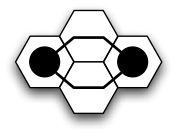

Figura 4. Una conexión implícita

El oponente no puede evitar que el negro conecte sus dos celdas; si el blanco se interpone en una de las casillas de la intersección, el negro se colocará en la otra y la conexión quedará establecida. En ambos caso se llega a un equivalente de:

Figura 5. Una conexión explícita

Esto es consecuencia directa de la geometría hexagonal de las casillas y representa un desafío considerable para los jugadores principiantes. De modo que siguiendo este razonamiento, podemos distinguir en el hex dos tipos de conexión: las **implícitas** (o débiles) y las **explícitas** (o fuertes).

**Plantillas de borde**

Cuando un jugador se aproxima a un borde y quiere conectar su cadena al mismo, conocer un pequeño número de reglas le facilitará enormemente este trabajo. Estas plantillas consisten en posiciones concretas y conjuntos de instrucciones para responder a una eventual intrusión del oponente en la conexión con el borde.

La figura representa una celda ocupada junto a un borde (extremo inferior). El jugador blanco no puede impedir la conexión.

Figura 6. Una plantilla de borde

Otro ejemplo: el blanco no puede obstruir los dos puntos simultáneamente, por lo que no puede evitar la conexión:

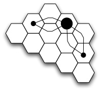

Figura 7. Y otra plantilla de borde

La figura anterior muestra dos ejemplos de plantilla de borde: si el oponente se coloca en cualquier celda tratando de obstruir la conexión, el jugador blanco puede colocar su ficha en uno de los puntos marcados para mantener la conexión implícita.

Las plantillas de bordes se agrupan en función de la distancia que queda hasta llegar al borde, y la propia definición de cada plantilla nos marca las celdas que necesitamos que estén libres para asegurar la posición, lo que nos permite conocer cuándo podemos utilizar esta plantilla. La siguiente ilustración nos muestra la plantilla para distancia 5:

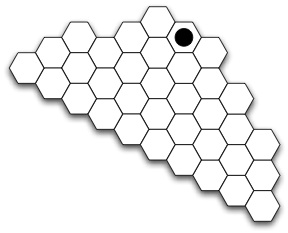

Figura 8. Plantilla para distancia 5 en tableros grandes

Existen multitud de plantillas para muchas situaciones distintas del juego, aunque las más útiles e importantes son las plantillas de borde. En todo caso, dominarlas no siempre es necesario si se aplica un razonamiento sólido a la posición y no se olvidan ciertos principios fundamentales.

**Murallas**

Las murallas o muros aparecen cuando un jugador es forzado por el oponente a formar una fila paralela a uno de sus bordes del tablero. El oponente consigue así, en principio, evitar la conexión.

El muro supone, al mismo tiempo, una conexión válida en el sentido del jugador obstructor, por lo que si el jugador bloqueado no rompe de alguna manera el muro perderá la partida.

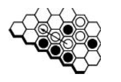

Figura 9. Un muro. (Copyright © 2005 Thomas Maarup)

En la figura anterior, el jugador negro impide que el blanco termine una conexión con este borde del tablero, forzándole a continuar el muro si quiere tener posibilidades de completar esta conexión.

A su vez, el negro está componiendo una conexión, por lo que el blanco deberá partir el muro de alguna forma. Existen plantillas para “romper” o “escapar” de los muros, aunque no es necesario utilizarlas.

**Bloqueos**

La naturaleza hexagonal del tablero hace que obstruir una conexión sea una tarea verdaderamente complicada. Si intentamos detener el avance de un jugador situando nuestra ficha una casilla más lejos, estamos construyendo un bloqueo que puede esquivarse utilizando las casillas adyacentes.

La defensa clásica contra el puente es intentar bloquear la conexión tres celdas más lejos, como muestran los movimientos etiquetados con un 2 en la siguiente ilustración:

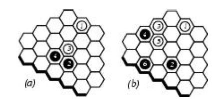

Figura 10. Cortar el paso. (Copyright © 2005 Thomas Maarup)

### Algunos principios generales

Existen algunos principios generales muy útiles en este juego que, no obstante, deben ser tomados como ayudas y no como normas estrictas: debemos apoyarnos siempre en el sentido común y el cálculo.

**Ataque = defensa**

En el hex, un buen ataque es tan potente como una buena defensa. Precisamente por ser un juego de suma cero, nuestra mejor jugada ofensiva es, a la vez, nuestra mejor jugada defensiva. Muchas veces, en el transcurso de la partida, no se aprecia con claridad cuál es la mejor jugada ofensiva para un jugador, pero sí se puede pensar en cuál perjudica más al adversario. Existe una equivalencia muy interesante en este sentido: un bloqueo perfecto es, a su vez, una conexión.

**Iniciativa**

Se dice que el jugador que lleva el control de la dirección del juego tiene la iniciativa. Aunque la iniciativa oscila entre ambos jugadores, en el hex estar en posesión de la misma supone una ventaja muy destacable. Este concepto está relacionado con el de “tempo” o “tiempo” del ajedrez, que se refiere a la **optimización de jugadas**: no se debe hacer con dos movimientos lo que se puede hacer en uno, ya que dejamos de aprovechar una jugada y esto representa una ventaja muy clara para el oponente.

En ajedrez, mantener la iniciativa es una gran ayuda táctica, pero en el hex es absolutamente imprescindible si se quiere ganar la partida.

**Ramificación del movimiento**

Una buena jugada en hex ha de permitir desarrollar alternativas, para hacer frente a los intentos de bloqueo del rival: si un movimiento consta de varios “hilos” el contrincante no podrá detenerlos todos.

Un puente entre dos celdas es un buen ejemplo de esto.

**Jugar en todo el tablero**

En el hex el largo plazo es muy importante, y en consecuencia no debemos limitarnos a desarrollar nuestro juego en una única parte del tablero. Sin embargo, es muy complicado mantener un plan para el tablero completo, por lo que es mejor, a corto plazo, dividir el juego en secciones y concentrarse en cada una de ellas. Esto no significa que podamos obviar el resto del tablero.

**Forzar movimientos**

Existen muchas secuencias de movimientos forzados en el hex, que dan la victoria al oponente si no se ejecutan. Manteniendo la iniciativa, puede ser interesante forzar al rival a hacer ciertos movimientos. Existen otras variantes, como las derivadas de intrusiones en conexiones y la aplicación de plantillas.

**Dominio del centro**

Es importante controlar el centro del tablero. Desde aquí, las conexiones puede tomar muchos sentidos, muchos más que si parten del borde, desde donde hay menos posibilidades.

## Teoría del hex

El hex es un juego muy interesante desde un punto de vista puramente matemático, y como tal ha fascinado muchos amantes de esta disciplina desde el instante mismo de su invención.

Dentro de la teoría de juegos, el hex se encuadra en la categoría de **juegos abstractos finitos** de **dos jugadores** con **información completa** y **sin influencia del azar** (determinista). El hex es, además un juego de **suma cero**, lo que en la práctica implica que siempre tiene que existir un ganador. En este caso, además, sabemos que este ganador ha de ser único.

De acuerdo con esto último, una partida de hex no puede terminar en empate. Esta propiedad se deduce del hecho de que si todas las celdas del tablero están ocupadas, debe existir una conexión ganadora para uno de los jugadores. Aunque este hecho parece evidente, la propiedad no es trivial; de hecho, es equivalente al teorema del punto fijo de Brouwer para cuadrados de dos dimensiones [12]. Siguiendo este razonamiento, es sencillo llegar a la conclusión de que ha de existir una estrategia ganadora para uno de los jugadores, como veremos más adelante.

En todo juego entre dos jugadores, con información completa y determinista (no depende del azar), existe una estrategia óptima que consiste en maximizar o minimizar los valores asignados a cada estado del juego. El valor del estado Ti se asigna recursivamente siempre que Ti sea seguido de al menos un movimiento posible Ti+1.

v(Ti) = 1 si el jugador A ha ganado.

v(Ti) = -1 si el jugador B ha ganado.

v(Ti) = máx(v(Ti+1)) si el jugador A mueve.

v(Ti) = mín(v(Ti+1)) si el jugador B mueve.

Dados estos valores orientativos, obviamente el jugador B ha de minimizar cada movimiento y A maximizarlo. De esto se puede extraer la conclusión de que el segundo jugador en mover no tiene nada que hacer si el primer jugador sigue su estrategia óptima.

Conocer la estrategia óptima de un juego es una buena forma de acabar con él. Sin embargo, la estrategia ganadora en el hex continúa siendo una incógnita.

### Estrategia ganadora

Informalmente, llamamos **estrategia ganadora** a una secuencia de movimientos que un jugador tiene disponibles, que el adversario no puede evitar y que le conducen a la victoria.

Como se ha dejado establecido en la sección anterior, del hecho de que el hex sea un juego de suma cero podemos deducir que el primer jugador dispone de una estrategia ganadora, a través de un razonamiento que a continuación enunciaremos.

Probablemente, el hecho de que el primer jugador disponga de una estrategia ganadora fue descubierto de forma independiente por varios matemáticos tras la aparición del juego. Los escritos originales de Hein sugieren que conocía esta circunstancia, y a través de varios trabajos de J. Nash se sabe que también llegó a esta misma conclusión empleando un razonamiento similar al siguiente.

Podemos argumentar una demostración de este extremo utilizando un "robo de estrategia" [1, 6]:

Dado que el primer o el segundo jugador deben ganar, entonces debe haber una estrategia ganadora para alguno de los jugadores, sea el primero o el segundo.

Supongamos que por lo menos el segundo jugador posee una estrategia ganadora.

El primer jugador puede adoptar la siguiente defensa: realizar un primer movimiento aleatorio, y posteriormente ejecutar la estrategia ganadora del segundo jugador que asumimos como existente. Adoptar esta estrategia le convierte implícitamente en el segundo jugador, aunque con una ficha extra sobre el tablero.

La primera ficha no puede interferir en la imitación de la estrategia ganadora, porque una pieza extra supone siempre una ventaja. Luego el primer jugador puede ganar.

Esto entra en contradicción con el hecho de asumir que existe una estrategia ganadora para el segundo jugador, por lo que debemos descartar esta posibilidad.

En consecuencia, existe una estrategia ganadora para el primer jugador.

Esta breve e informal demostración se apoya en un lema y un teorema enunciados a continuación, cuyas demostraciones no se verán aquí por ser poco relevantes. Pueden consultarse en la bibliografía sobre el tema, en concreto en [6].

**Lema 1:** Una partida de hex no puede terminar en empate.

Esto implica que ni ambos jugadores pueden ganar ni puede terminar el juego sin que haya ganado ningún jugador. Este lema puede demostrarse analizando el tablero de hex como un grafo plano no dirigido.

**Teorema 1:** Para cualquier juego de dimensión n x n, el primer jugador posee una estrategia ganadora.

Hay que advertir, no obstante, que este teorema sólo enuncia la existencia matemática de la estrategia ganadora y no implica que exista una construcción práctica de esta estrategia ni que tal construcción sea conocida.

## Complejidad

Acabamos de ver cómo en el hex existe una estrategia ganadora para el primer jugador para tableros de cualquier tamaño. También comentamos que no podíamos esperar descubrir dicha estrategia. En esta sección se buscará algún tipo de aproximación a una estrategia ganadora general.

### Resolviendo el hex por fuerza bruta

Esta es una solución del hex que en principio es directamente accesible: jugar todas las partidas posibles de hex. Aparentemente, automatizando este proceso, no debería ser demasiado complicado. Pero lo es.

Podríamos considerar cualquier tablero de n x n celdas, numerarlas desde 1 hasta n2 y mover ficha sobre ellas en orden. Así, el primer juego completo empezaría {1, 2, 3, ..., n2 - 1, n2}, el siguiente sería {1, 2, 3,..., n2 - 2, n2, n2 - 1} y así sucesivamente.

Podemos descartar un gran número de partidas:

Las partidas que comienzan {1, 2, 3, 4, 5,...} son la misma que las que empiecen por {3, 2, 1, 4, 5,...}

Muchos juegos terminan antes de que el tablero esté completo, por lo que podríamos ignorar el resto de movimientos. Podemos hacer una aproximación optimista y suponer que, de media, los juegos utilizan la mitad de las celdas disponibles.

Finalmente, la mitad de los juegos quedan cubiertos por simetría.

Esto nos lleva a que el número total de partidas es el número de formas en que un jugador puede ocupar un cuarto de las celdas multiplicado por las formas en que el otro jugador puede ocupar otro cuarto de las celdas, dividido entre 2:

$$
\frac{
\begin{pmatrix}
n^{2} \\
\frac{1}{4}n^{2}
\end{pmatrix}
\cdot
\begin{pmatrix}
\frac{3}{4}n^{2} \\
\frac{1}{4}n^{2}
\end{pmatrix}
}{2}
$$

Si fuéramos capaces de ejecutar un movimiento por segundo, una partida de dimensión n nos llevaría, en segundos [6]:

$$
\frac{n^{2}!\,\left(\tfrac{3}{4}n^{2}\right)!\,n^{2}}
{\left(\tfrac{1}{4}n^{2}\right)!\,\left(\tfrac{3}{4}n^{2}\right)!\,\left(\tfrac{1}{4}n^{2}\right)!\,\left(\tfrac{1}{2}n^{2}\right)!\cdot 4}
$$

Así por ejemplo, resolver totalmente el tablero de 2 × 2 llevaría 12 segundos. El de 3 × 3 nos llevaría 2400 segundos, hasta llegar al tablero estándar de 11 × 11, para cuya resolución necesitaríamos 10^54 segundos, o dicho de otro modo, 3 × 10^46 años. La imagen siguiente da una idea más clara de la magnitud de los tiempos, representando tiempo frente a dimensión, el último valor visible corresponde a dimensión 4.

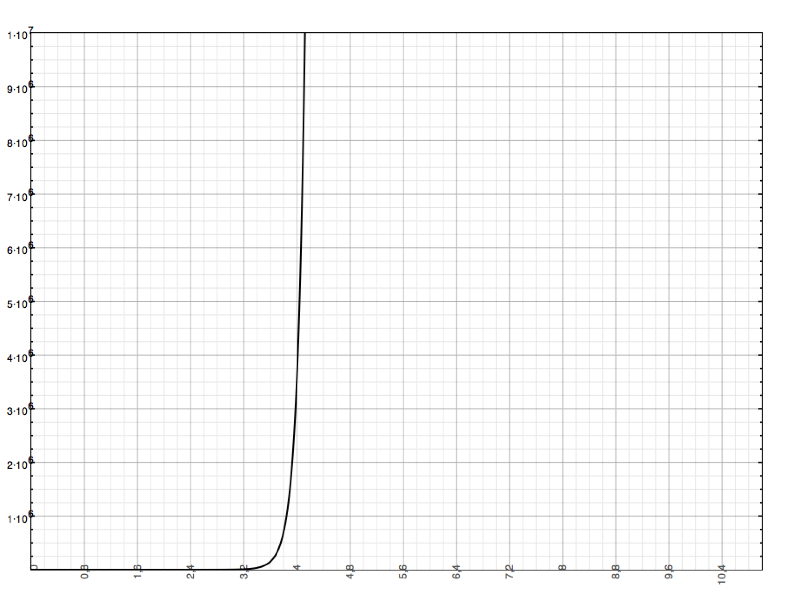

Figura 11. Tiempo frente a dimensión del tablero

Por supuesto, las computadoras son mucho más rápidas que esto, pero nos da una idea del factor de tiempo necesario para resolver un tablero grande. No parece viable resolver completamente el hex en un periodo razonable de tiempo.

### Clasificación

Es importante distinguir entre los problemas verdaderamente **indecidibles** y aquellos que son solo **intratables**. Un problema es indecidible cuando dado un algoritmo general y una entrada concreta no se puede saber si se ejecutará siempre o se detendrá después de un número finito de pasos.

En principio el hex de dimensión n x n es un problema resoluble, aunque sea intratable en la práctica –es decir, dada una posición cualquiera, no disponemos de un algoritmo que pueda ejecutarse en un tiempo polinómico que nos permita conocer qué jugador dispone de una estrategia ganadora y obtenerla–.

El hex está parcialmente resuelto para tableros pequeños, pero realmente en este caso estamos interesados en encontrar una solución general en función de la dimensión. Que el juego esté **resuelto** significa que para cualquier posición dada se conoce qué jugador de los dos tiene una estrategia ganadora. Un tratamiento adecuado puede conducirnos además a obtener dicha estrategia.

Una solución para el hex consistiría en un algoritmo que puede ejecutarse en tiempo polinómico y que devolviera un movimiento ganador para cualquier posición sobre un tablero de cualquier dimensión.

El concepto de intratabilidad se refiere a la disponibilidad de los recursos computacionales necesarios para resolver un problema. En función de estas necesidades los problemas se clasifican en diferentes **clases de complejidad**.

Una característica importante de la teoría de la computabilidad es que los problemas son generalmente reescritos como **problemas de decisión**, en concreto como preguntas que pueden responderse con un “si” o un “no”. Esto es útil porque nos permite transformar los problemas y comparar unos con otros. En nuestro caso, podríamos convertir al hex en un problema de tipo:

| Tipo de problema | Hex |
|---|---|
| Datos | Un tablero de hex parcialmente relleno (o vacío) de dimensión n×n con una posición p. |
| Pregunta | ¿El movimiento p es parte de alguna estrategia ganadora? |

La pregunta puede ser formulada para el jugador que posee el turno. En caso de que se responda con un “no”, el jugador debería volver a formular la pregunta hasta que la evaluación de **todas** las celdas vacías arrojara respuesta negativa. En este caso el oponente sería el poseedor de la estrategia ganadora en el movimiento siguiente.

Es posible contestar esta pregunta y utilizarla para descubrir una estrategia ganadora para cualquier tablero en un tiempo finito. Sin embargo, el tiempo requerido para llegar a una solución **crece por encima del polinómico** en proporción al tamaño del problema (en nuestro caso, el tamaño del tablero).

### Clases P y NP

En la sección anterior mostramos algunos cálculos que evidencian la enorme cantidad de tiempo necesaria para resolver la versión estándar del hex mediante la única aproximación conocida, que es la exhaustiva. El tiempo crece exponencialmente en función del tamaño del tablero.

En torno a 1960, **Jack Edmonds** introdujo la noción de buen algoritmo como aquel que produce una respuesta en un tiempo inferior al polinómico, relativo al tamaño del problema. Para el hex, el tamaño del problema es el número n de celdas del tablero. Normalmente denotamos como n el número de celdas del borde –la dimensión–, pero de cara a un objetivo computacional se prefiere denotar el número total de casillas del tablero. En cualquier caso, cualquier confusión entre ambas no da lugar a ninguna diferencia práctica, ya que se puede considerar que n2 equivale a n.

A esta definición se corresponde una clase de **complejidad P** (de polinómica) de problemas que son resolubles con buenos algoritmos. Hasta la fecha, no se conoce ningún algoritmo de este tipo que permita resolver el hex.

Muchas veces, sin embargo, una solución a un problema complicado puede ser verificada en algunos casos en un tiempo polinómico: es el caso del conjunto de problemas que pueden ser **resueltos en tiempo polinómico por una máquina de Turing no determinista**, y que reciben el acrónimo **NP**, de polinómico no determinista. No está claro, pero hay razones para pensar que P = NP. Sin embargo, esta cuestión todavía no ha sido aclarada, aunque hay un motivador premio de un millón de dólares para quien demuestre o rechace la igualdad anterior. En todo caso, normalmente se supone que P es un subconjunto de NP.

Una consecuencia de la ausencia de una respuesta sobre si es cierto P = NP es que existen problemas en NP de los que no podemos saber si tienen una buena solución o no. Algo que conocemos sobre este grupo es que si existe una solución polinómica para al menos uno de ellos, entonces podremos encontrar soluciones polinómicas para todos los problemas NP-completos. Un problema se considera NP-completo si es posible reducir todos los problemas de NP a éste mediante una transformación polinómica, lo que implica que transformar un problema NP-completo conocido en un problema NP probará que es NP-completo.

Es sabido que el Hex es al menos tan complicado como un problema NP-completo, a lo que nos referimos como NP-difícil.

### El hex es ESPACIOP-completo

**Stefan Reisch** demostró [4] que el hex es un problema completo en el espacio P. Por su lado, unos años antes, **Simon Even** y **R. E. Tarjan** mostraron [3] que una versión generalizada del hex llamada “Shannon Switching Game” es ESPACIOP-completo.

Ambas demostraciones parten de la clasificación razonada en la sección anterior y son lo suficientemente complejas como para no tratarlas aquí. Pueden consultarse en la bibliografía referida.

## Una aproximación formal

Hasta ahora se han hecho algunas valoraciones generales en torno al hex, aportando algunas ideas útiles para comprender un estudio más profundo del juego y los recursos que podemos utilizar los humanos en el hex. Sin embargo, nuestro objetivo es construir un sistema capaz de jugar por sí solo al hex y para ello debemos formalizar lo máximo posible algunos de los conceptos estudiados anteriormente. Un soporte más sistemático nos permitirá trazar equivalencias entre las ideas y técnicas del hex y el lenguaje computacional más fácilmente.

Esto puede parecer una contradicción, sobre todo cuando se acaba de mostrar la dificultad de encontrar una solución sistemática computacionalmente. Sin embargo, los ordenadores son capaces de jugar razonablemente bien al hex, por lo que podemos pensar que existe algún método para simplificar el estudio del juego. A lo largo de esta sección y las siguientes introduciremos algunas ideas en este sentido, hasta llegar a un método que nos permita elegir el mejor movimiento disponible.

Aunque las reglas del Hex son sencillas, el juego requiere un conocimiento profundo de la estrategia e importantes habilidades tácticas. Las técnicas de búsqueda masiva en árbol, desarrolladas en los últimos cuarenta años principalmente para el ajedrez y utilizadas satisfactoriamente en las damas, resultan bastante menos útiles en juegos con factores de ramificación elevados como el Hex o el Go. De hecho, para un tablero convencional de Hex de 11 x 11, la media de movimientos legales es de 100, mientras que para el ajedrez es de 38 y para las damas es de 8, tal y como se adelantó en la introducción.

El análisis del hex requiere, en este sentido, un planteamiento más sofisticado que en el caso de otros juegos: el hex es muy sencillo en su concepción, y lo que hace que una jugada sea mejor que otra responde a diferencias muy sutiles y a un planteamiento a largo plazo. Además, apenas existe espacio para el fallo, salvo si la situación está muy bien asegurada. Esto hace que el trabajo de análisis computacional de las posiciones del hex sea muy delicado y bastante complejo.

### La jerarquía como punto de partida

En el estudio de los juegos en general, las posiciones complejas pueden ser descompuestas en sumas de posiciones más sencillas. Puede considerarse que un juego puede descomponerse en varios subjuegos. Este es un método que se aplica en la computación del Go, juego de reconocida complejidad computacional.

Aunque no todas las posiciones de Hex pueden descomponerse en una suma de juegos “locales”, muchas pueden considerarse combinaciones de juegos más sencillos. Aplicando diversas reglas de deducción a los subjuegos más sencillos podemos ver cómo éstas pueden ser usadas recursivamente para calcular valores de subjuegos más complejos.

A continuación se detallan algunas consideraciones dirigidas al estudio posterior de una función heurística que permita analizar el juego. Para este estudio deben tenerse en cuenta determinadas características del juego que se explican a continuación.

### Conexiones y semiconexiones virtuales

Los bordes pueden considerarse como celdas del color correspondiente, para generalizar la forma en que el sistema trata las conexiones.

**Nota**: Las siguientes definiciones se plantean, por simplicidad, desde el punto de vista de un jugador (las negras), pero la idea para el adversario es equivalente.

**Definición 1: Subjuego**

Sean x e y dos celdas diferentes, y sea A un conjunto de celdas vacías en una posición dada. Asumiendo que x ∉ A e y ∉ A, podemos considerar la terna (x, A, y) como un subjuego, donde el jugador negro intenta conectar x con y por medio una cadena de piezas negras, el jugador blanco trata de prevenirlo y ambos jugadores sólo pueden colocar sus piezas en las celdas de A.

Definimos x e y como finales o extremos del subjuego y A como el camino entre ambos.

**Definición 2: Conexión virtual**

Un subjuego es una conexión virtual si y sólo si el jugador negro tiene una estrategia ganadora aunque el blanco juegue primero.

**Definición 3: Semiconexión virtual**

Un subjuego es una semiconexión virtual si y sólo si el jugador negro tiene una estrategia ganadora cuando mueve primero y no cuando mueve en segundo lugar.

Aunque una conexión virtual no está establecida físicamente, es imposible de evitar, por lo que las casillas implicadas en una conexión virtual están conectadas de facto o virtualmente. Las semiconexiones virtuales reciben este nombre porque por sí solas no pueden considerarse conexión, aunque sí en combinación con otras. Así, dos semiconexiones virtuales entre dos casillas equivalen a una conexión virtual.

En la práctica es conveniente usar las siguientes definiciones recursivas (definiciones 4 y 5).

**Definición 4 (recursiva):** **Conexión virtual**

Un subjuego es una conexión virtual si y sólo si para todo movimiento de las blancas existe un movimiento de las negras que hace que el subjuego resultante sea una conexión virtual.

**Definición 5 (recursiva):** **Semiconexión virtual**

Un subjuego es una semiconexión virtual si y sólo si no es una conexión virtual y existe un movimiento de las negras que hace que el subjuego resultante sea una conexión virtual.

Solemos representar las conexiones virtuales con un rectángulo blanco entre celdas y las semiconexiones virtuales con un rectángulo tachado (en este caso, oscurecido) entre las celdas, como se muestra en la siguiente figura:

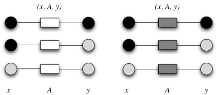

Figura 12. Diferentes conexiones y semiconexiones

**Definición 6: Profundidad de una conexión virtual**

Sea una posición conexión virtual y el blanco el primero en jugar. El número de movimientos que deben ejecutarse para que el negro gane el subjuego, considerando que el negro trata de minimizarlo y el blanco de maximizarlo, caracteriza la profundidad de la conexión virtual.

La profundidad de una conexión virtual equivale a la profundidad de búsqueda en árbol de juego requerida para establecer sobre el tablero la conexión virtual.

*Ejemplos*:

Dos celdas vecinas forman una conexión virtual con una ruta vacía, con una profundidad de 0.

Un puente doble forma una conexión virtual de profundidad 2.

**Definición 7: Conexión mínima**

La conexión virtual (x, A, y) es mínima si y sólo si no existe una conexión virtual (x, B, y) tal que B ⊂ A (B subconjunto de A) y B ≠ A. Si un subjuego (x, A, y) es una conexión virtual y (x, C, y) es un subjuego tal que A ⊂ C, el juego (x, C, y) es conexión virtual.

**Definición 8: Conexión virtual ganadora**

Una conexión virtual entre las celdas de borde equivale a ganar el juego. Si existe, existe también una estrategia ganadora para el jugador negro aunque el jugador blanco mueva antes.

## Descripción de la heurística

Una vez sentadas ciertas ideas, podemos introducir ya una primera aproximación a la parte más “inteligente” de la aplicación. Pero primero veamos algunas nociones en torno a este concepto.

En concreto, es importante la idea de que este tipo de sistemas son, en realidad, problemas de búsqueda de soluciones. Un **algoritmo de búsqueda** toma como entrada un problema y devuelve una solución en forma de secuencia de acciones, que después pueden, opcionalmente, ejecutarse. En la búsqueda de soluciones a problemas, generalmente diferenciamos la búsqueda “a oscuras” o **no informada** de la búsqueda **informada**. En una estrategia de búsqueda no informada sólo disponemos de información del sistema a un nivel de observación, por lo que no podemos basarnos en otro tipo de información adicional en nuestro proceso de búsqueda.

Al contrario que una estrategia no informada, una estrategia de búsqueda informada utiliza un conocimiento específico del problema más allá de su definición, pudiendo encontrar soluciones al problema de una manera más eficiente que una estrategia no informada. Las búsquedas mediante estrategias informadas son también conocidas como heurísticas.

### ¿Qué es una heurística?

Se denomina heurística a la **capacidad de un sistema** para realizar de forma inmediata innovaciones positivas para sus fines. La capacidad heurística es un rasgo característico de los humanos, desde cuyo punto de vista puede describirse como el arte y la ciencia del descubrimiento y de la invención o de resolver problemas mediante la creatividad.

Desde un punto de vista computacional, dos objetivos fundamentales para la mayoría de casos son encontrar algoritmos con buenos tiempos de ejecución y buenas soluciones, usualmente las óptimas. Una **heurística** es un algoritmo que ofrece uno o ambos objetivos; por ejemplo, normalmente encuentran buenas soluciones, aunque en ocasiones no hay pruebas de que la solución no pueda ser arbitrariamente errónea; o se ejecuta razonablemente rápido, aunque no existe tampoco prueba de que deba ser así.

A menudo, pueden encontrarse instancias concretas del problema donde la heurística producirá resultados muy malos o se ejecutará muy lentamente. Aún así, estas instancias concretas pueden ser ignoradas porque no deberían ocurrir nunca en la práctica por ser de origen teórico, y el uso de heurísticas es muy común en el mundo real.

En su aplicación a los juegos, una heurística se compone de:

Un **estado inicial**, compuesto, en este caso, por el tablero y la información sobre el jugador que tiene el turno.

Una **función de cómputo**, también denominada *función de evaluación* o *función heurística*, que determina el valor de un movimiento para el jugador actual.

Una **función sucesor**, que determina el siguiente movimiento a evaluar.

Una **prueba** o **test terminal**, que determina cuándo finaliza el juego y qué jugador resulta ganador.

Evidentemente, una heurística sólo tiene sentido en un contexto de búsqueda de la mejor solución disponible (en este caso, la mejor jugada). El estado inicial y los movimientos legales para cada lado definen el **árbol de jugadas**.

### Árboles de jugadas

En un enfoque tradicional, podemos considerar la existencia de dos jugadores, MIN y MAX, que compiten por lograr el objetivo del juego. Estos jugadores reciben estos nombres por el uso que hacen de la función de evaluación. Generalmente, una jugada buena para un jugador es proporcionalmente mala para el otro. Aunque esto pueda parecer enrevesado, es una consecuencia de la oposición de intereses que se da en los juegos: una jugada buena para un jugador le aproxima al objetivo, lo que implica que su oponente se aleja del mismo.

Así, podemos pensar que el objetivo de un jugador es maximizar el valor de las jugadas y el del oponente minimizarlo. Normalmente al primer jugador lo llamamos MAX y al segundo MIN. Cuando trazamos un árbol de jugadas, dibujamos para cada posibilidad, las alternativas disponibles que tiene el oponente. Luego en el árbol de jugadas se alternan los nodos MAX y MIN.

El siguiente gráfico muestra parte del árbol de jugadas del “tres en raya”. Podíamos considerar que el primer nodo corresponde al jugador MAX, que en este caso serían las fichas marcadas como estrellas. El primer nodo es MAX porque este jugador tiene el turno, de modo que debe ejecutar un movimiento que maximice su cómputo. Cuando haya ejecutado este movimiento nos encontraremos en el nivel 2 del árbol, con una estrella colocada en el tablero. En este momento, será el turno del jugador MIN, que deberá contrarrestar esta situación mediante un movimiento que minimice su cómputo. Y así sucesivamente.

Figura 13. Un segmento del árbol de jugadas para el tres en raya

Definimos **valor-minimax** de un nodo como la utilidad para un jugador de un nodo correspondiente, asumiendo que ambos jugadores juegan óptimamente desde ese nodo hasta el final. El valor minimax de un estado terminal es el de su función de utilidad o heurística. Considerando las opciones, MAX preferirá moverse a un estado de valor máximo, mientras que MIN preferirá uno de valor mínimo. Informalmente,

El **algoritmo minimax** calcula la decisión minimax más apropiada al estado actual. Se basa en un cálculo recursivo de los valores-minimax para cada sucesor de un nodo. La recursión avanza hacia las hojas del árbol y al llegar a estas y calcular la función utilidad, estos valores retroceden por el árbol.

### Poda alfa–beta

La búsqueda minimax tiene que examinar un número de estados que crece de forma exponencial con el número de movimientos, aunque esta circunstancia puede reducirse al menos a la mitad.

La técnica que se utiliza para reducir el árbol se denomina poda, y en el caso del algoritmo minimax se suele utilizar la llamada poda alfa-beta, que cuando se aplica a un árbol minimax convencional devuelve el mismo movimiento que devolvería el algoritmo sin poda.

La idea general de la poda es que no hace falta ahondar en lo mala que es una posibilidad. Es decir, si se encuentra una variante peor que la peor que se había detectado hasta el momento, no merece la pena evaluarla. Para delimitar y mantener estos valores se utilizan dos parámetros (α y β) de los que el método toma el nombre.

Dado que **no** es objetivo de esta memoria ofrecer una descripción detallada de estos algoritmos, se recomienda acudir a la bibliografía especializada. En concreto es interesante consultar [9] y [10].

### Una primera idea

La función de cómputo más razonable conocida para el hex se basa en un método denominado **H-Search**, que nos permite generalizar ciertos patrones conocidos extendiéndolos al tablero completo. De esta forma, a través del análisis de entornos reducidos, podremos llegar a una valoración de un entorno general. Este algoritmo fue introducido por V. Anshelevich [1], el autor de la mayor parte de la documentación existente sobre este tema.

La idea general de este método consiste en que una jugada será más o menos buena en función de **que minimice la distancia de un jugador entre los bordes** y procure maximizar esta distancia para el oponente. La dificultad reside en el hecho de que, aunque no exista una conexión sólida entre dos celdas, sí pueden formar una conexión implícita, que es igual de fuerte, por lo que tenemos que tener muy en cuenta a estas estructuras en nuestro diseño. La idea central consiste en que el programa sea capaz de detectar las conexiones y combinarlas para simplificarlas.

Para poder estimar esta distancia debemos primero calcular la **distancia virtual** que separa los bordes de cada jugador. Diremos que se trata de una distancia virtual porque no se corresponde exactamente con la distancia visible en el tablero, sino que se deriva del estado subyacente del juego: así, puede existir una conexión de un jugador imposible de evitar. Aunque esta conexión no esté cerrada físicamente, sí lo está implícitamente, por lo que podemos considerar que existe una distancia nula entre los bordes. Podemos definir la distancia virtual como la distancia entre los bordes de un jugador teniendo en cuenta las conexiones virtuales establecidas.

Así pues, para obtener un valor de esta distancia, primero debemos definir sobre una representación del tablero las conexiones que reflejen la verdadera situación del juego, creando ciertos enlaces adicionales. Para obtener esta representación son muy útiles las dos reglas AND y OR que veremos en la sección siguiente.

### Reglas de deducción

Estos enlaces se crean aplicando dos reglas de deducción de origen recursivo, la regla AND y la regla OR. Estas reglas permiten construir conexiones virtuales complejas partiendo de otras más sencillas, constituyendo un álgebra para las conexiones virtuales.

Siempre desde el punto de vista de las negras, estas reglas se enuncian así:

**La regla AND**

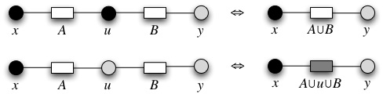

Figura 14. Esquema de la regla AND

Sean los subjuegos (x, A, u) y (u, B, y) dos conexiones virtuales con un extremo común en u y otros dos diferentes x e y tales que x ≠ y. Asumimos que x ∉ B, y ∉ A, A∩B = ∅.

Si u es negra, entonces el subjuego (x, A ∪ B, y) es una conexión virtual.

Si u está vacía, entonces el subjuego (x, A ∪ u ∪ B, y) es un semiconexión virtual.

Dicho de otra manera más informal, dos conexiones virtuales con un extremo común equivalen a extender dicha conexión a otra que incluya las pertenecientes a ambas conexiones. Si este extremo común es una celda negra, ambas conexiones virtuales forman a su vez una conexión virtual con esta celda, por lo que es una conexión virtual estricta. En otro caso, el jugador blanco puede jugar sobre esta celda de unión e impedir la conexión, de modo que será simplemente una semiconexión virtual.

**La regla OR**

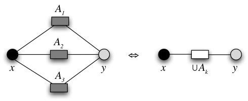

Sean varios subjuegos (x, Ak, y), con k = 1, 2, 3, ..., n (para n > 1) con extremos comunes y que sean semiconexiones virtuales. Si la intersección de todos los caminos Ak es vacía, el subjuego (x, A, y), en el que A es la unión de todos los Ak, forma una conexión virtual.

Dicho de otro modo, si entre dos casillas existen dos o más semiconexiones virtuales, entonces podemos afirmar que existe una conexión virtual entre ellas. Esto es así porque si el jugador blanco intercepta una semiconexión virtual, el negro podrá asegurar la que haya quedado libre.

Combinando la regla OR y la regla AND podemos simplificar el juego, en un orden de jerarquía inversa, como se muestra en la figura:

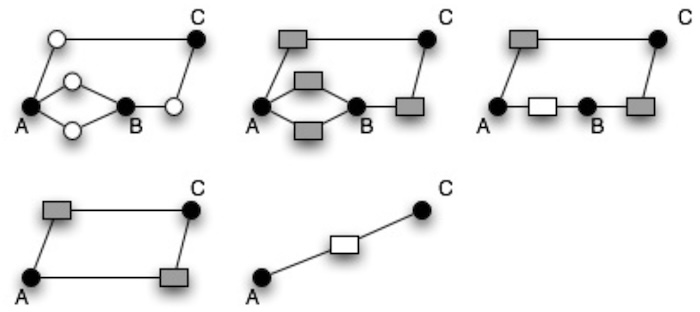

Figura 16. Una deducción entre A y C

### Descubrir conexiones con H-Search

A pesar de la sencillez conceptual de las reglas AND y OR, la búsqueda de conexiones y de casillas que verifiquen dichas reglas no es ni mucho menos trivial. El algoritmo H-Search permite aplicar a las casillas y a las listas de conexiones una serie de operaciones que nos permitan deducir nuevas conexiones implícitas. Estas nuevas conexiones deberían quedar reflejadas en el grafo añadiendo nuevos enlaces entre las casillas.

El algoritmo H-Search se basa en la equivalencia de unas posiciones complejas en otras más sencillas, o lo que es lo mismo: cómo se construyen conexiones complejas a través de otras más simples. Precisamente esta idea jerárquica es la que da el nombre al algoritmo H-Search, abreviatura de “Hierarchical Search”, búsqueda jerárquica en inglés.

El algoritmo H-Search no es otra versión de la habitual búsqueda en árbol para juegos. La H-Search y la búsqueda en árbol utilizan diferentes representaciones del problema y, como resultado, buscan en diferentes espacios. En particular, H-Search busca conexiones virtuales en el conjunto de subjuegos de una posición de hex.

Esto nos lleva a otra pregunta: ¿es el conjunto de las reglas AND y OR completo? Es decir, ¿puede el algoritmo H-Search construir todas las conexiones virtuales comenzando desde las más sencillas? La respuesta es que no, y existen ejemplos de conexiones virtuales que no pueden ser construidas mediante este procedimiento.

Hay que decir, eso sí, que las reglas AND y OR pueden ser generalizadas para convertirlas en reglas completas. Sin embargo, la búsqueda H-Search generalizada no ha sido probada con buenos resultados y su valor práctico no está todavía claro. El algoritmo de búsqueda H-Search está implementado en Hexy y en Six. Ambos programas son realmente fuertes y han ganado diversas competiciones.

Sirviendo esto como anticipo, más adelante se ofrecerá un análisis pormenorizado de cómo se realiza este proceso.

### Función de evaluación y circuitos eléctricos

Una vez establecidas las relaciones (descubiertas a través de H-Search) y representadas sobre un grafo, que es en realidad un tablero simplificado, debe ejecutarse sobre éste un algoritmo que calcule la distancia global entre los bordes de un mismo color. Nos referiremos a estas resistencias como RN (para las negras) y RB (para las blancas).

El cálculo de esta distancia equivale a resolver la **resistencia eléctrica equivalente** en un circuito obtenido a partir del grafo [13], sustituyendo las aristas por enlaces eléctricos con una resistencia variable (resistores). El valor de estas resistencias es el mismo que el de las aristas del grafo. Esta idea, de una gran belleza, fue implementada por primera vez por Shannon [14]. La idea, para el caso de las negras, se muestra así:

Figura 17. ¿Circuito o tablero?

El cálculo de los valores de las aristas se calcula en función del de los vértices. Así, cada vértice c toma una pareja de valores rb(c) y rn(c). Cada parámetro puede tomar tres valores distintos, a saber:

$$
r_b(c)=
\begin{cases}
1 & \text{si } c \text{ está vacía} \\
0 & \text{si } c \text{ está ocupada por las blancas} \\
\infty & \text{si } c \text{ está ocupada por las negras}
\end{cases}
$$

$$
r_n(c)=
\begin{cases}
1 & \text{si } c \text{ está vacía} \\
0 & \text{si } c \text{ está ocupada por las negras} \\
\infty & \text{si } c \text{ está ocupada por las blancas}
\end{cases}
$$

Para cada par de vértices vecinos (sean \(c_1\) y \(c_2\)), la arista que los une tiene:

$$
r_b(c_1,c_2)=r_b(c_1)+r_b(c_2)
$$

$$
r_n(c_1,c_2)=r_n(c_1)+r_n(c_2)
$$

Al modificarse el valor de un vértice (lo cual sólo puede suceder una vez a lo largo del juego) deben recalcularse los valores de las aristas que lo rodean.

Con los datos de resistencias adecuados, debemos definir un grafo que represente un circuito eléctrico. Para ello, añadiremos un conductor entre dos celdas x e y si forman una conexión virtual, de la misma manera que si fueran celdas vecinas.

Una vez establecida esta similitud, calcular la distancia global entre los bordes equivale a calcular la resistencia equivalente del circuito, resolviendo su matriz asociada por un **método de iteraciones** convencional. Esta distancia, contrapuesta a la del oponente, nos da un valor numérico de la calidad de la jugada, que se obtiene a través de la expresión:

$$
E=\log\!\left(\frac{R_{N}}{R_{B}}\right)
$$

Otra medida razonable es la longitud del camino más corto en el grafo que conecte los bordes, aunque utilizar la resistencia en el circuito equivalente da un cálculo más preciso, al tener en cuenta las intersecciones y los diferentes caminos que conecten los bordes.

En el sistema construido, la función E es algo diferente, siguiendo la idea de un artículo anterior [11] de V. Anshelevich. En concreto, teniendo en cuenta que los valores mayores representan ventaja para las negras y los menores para las blancas:

$$
E=\frac{R_{B}}{R_{N}}
$$

De este modo, si la resistencia RN de las negras es nula, quiere decir que disponen de una CV entre sus bordes del tablero, con lo que en teoría habrán ganado la partida. El valor de esa jugada, entonces, será infinito.

En el caso de las blancas, si disponen de una conexión ganadora el valor de RB será igual a cero, y el valor global de la jugada también cero. El valor de E para el sistema implementado varía en el intervalo [0, ∞)

En otros juegos, al probar una jugada en la heurística se comprueba si esa jugada lleva a una condición de victoria mediante el test terminal. Así, si en una partida de ajedrez tenemos una jugada que nos lleva a *jaque mate* a nuestro favor, la ejecutaremos sin más. Sin embargo, en el hex esto no es del todo cierto, y en consecuencia la heurística no se apoya en el test terminal en ningún momento, pues apenas resulta útil. En su lugar, se considera que la jugada es ganadora simplemente con que conduzca a una conexión virtual ganadora. El resto del juego consistirá simplemente en concretar esta conexión y en no permitir que el adversario se interponga en ella.

## Encontrando la mejor jugada

A través de los procedimientos anteriores se obtiene un valor numérico de lo buena o mala que es una jugada. Una vez se han introducido estos conceptos, se verá cómo se relacionan entre sí para lograr devolver al sistema la mejor jugada disponible.

Cabe destacar que no se pueden representar todas las situaciones del juego utilizando la jerarquía del juego y la aplicación de las reglas AND y OR, pues no se trata de un conjunto completo. Esto implica que la decisión de la siguiente jugada ha de estar basada en diversos datos adicionales que es necesario tener en cuenta.

Así, el procedimiento general que nos conduce a la jugada que ejecutará el sistema es el siguiente:

Generar un árbol de búsqueda minimax con las posibles jugadas y las respuestas a éstas hasta una profundidad variable. Aplicar, si procede, poda alfa-beta a las ramas del árbol para agilizar el proceso. Para jugada que se desee evaluar, han de ejecutarse los pasos 2 y 3 para ambos jugadores.

Obtener las conexiones y semiconexiones virtuales equivalentes para cada tablero generado, mediante la aplicación del algoritmo H-Search.

Resolver el circuito eléctrico asociado a las conexiones descubiertas en el paso anterior y obtener el valor de la resistencia equivalente.

La parte verdaderamente interesante es la que corresponde a los puntos 2 y 3, y por lo tanto vamos a detallarlas en la siguiente sección.

### Calcular el valor de una jugada

Para calcular el valor de una jugada determinada, ésta debe simularse sobre el tablero de juego. El sistema creará un objeto Simulación para cada jugada que se vaya a simular, y poder trazar de esta forma los cambios realizados en las estructuras comunes.

**Aplicando el algoritmo H-Search**

Cuando se genera una simulación para analizar una jugada, se inserta en el tablero y se estudia si está rodeada de casillas de su mismo color. Esto es así porque varias celdas juntas del mismo jugador pueden simplificarse en el grafo interno por una misma, siempre que conservemos las conexiones.

Se hereda de la jugada anterior una copia del tablero, sobre la que se ejecutan todos los cambios. Esta copia contiene las conexiones virtuales iniciales del tablero: es decir, entre las celdas adyacentes existe una conexión de camino nulo (inmediata). Se guarda un registro de algunos cambios para deshacerlos, ya que algunas estructuras son demasiado complejas como para copiarlas.

Consideremos cualquier conjunto inicial de conexiones virtuales y semiconexiones virtuales como la primera generación de CV y SCV. En particular, este conjunto inicial puede consistir en las conexiones virtuales más sencillas, como lo son todos los pares de celdas vecinas del tablero. Aplicando la regla AND y la regla OR a los grupos apropiados de esta primera generación de CV y SCV, obtendremos una segunda generación. Entonces aplicaremos de nuevo las reglas de deducción AND y OR a la primera y a la segunda generación para construir la tercera generación de CV y SCV. Este proceso termina cuando no aparecen nuevas conexiones virtuales o se encuentra una conexión ganadora.

En la práctica, y debido a la limitación de los recursos computacionales, H-Search sólo es capaz de descubrir conexiones virtuales ganadoras en los tableros pequeños o en los finales de partida. Sin embargo, en el resto de las situaciones se consiguen aproximaciones muy descriptivas de la situación del tablero y el balanceo de fuerzas.

**Resolviendo el circuito eléctrico**

En principio, y de acuerdo a la documentación existente sobre el tema, con las conexiones obtenidas de la aplicación de H-Search, se debe obtener un circuito eléctrico que represente la situación del tablero. Después, debe generarse la matriz para este circuito y resolverla mediante un método de iteraciones o similar.

Sin embargo, este método puede simplificarse en extremo haciendo las siguientes consideraciones:

Anteriormente se estableció que la resistencia de una celda ocupada por el oponente es r = ∞. Si tenemos una rama N entre el nodo A y B, y rA= ∞ o bien rB = ∞, entonces sabemos que rN = rA + rB = ∞. En un circuito eléctrico si la resistencia es infinita, la corriente que circula por esa rama es nula, luego podemos descartar en nuestros cálculos todas las ramas adyacentes a nodos que representen celdas ocupadas por el contrario.

La abstracción del circuito eléctrico es útil por una cuestión intuitiva. Sin embargo, del circuito sólo nos interesa su matriz de resistencias, que es lo que nos sirve para resolver su ecuación. De acuerdo con esto, podemos omitir la construcción del circuito y elaborar directamente la matriz del mismo.

Así pues, recorremos un conjunto de casillas donde estén insertadas las propias del jugador que se evalúa. Para cada casilla obtendremos el estado de sus vecinas, y según este estado cargaremos el índice correspondiente de la matriz con su valor. Una vez terminada la matriz, se resuelve utilizando el método del Pivote de Gauss.

El valor obtenido es la resistencia equivalente del circuito, y el valor de la posición dada para el jugador estudiado.

### Pseudocódigo

A continuación se detalla el procedimiento anteriormente descrito en forma de pseudocódigo. Dicho procedimiento será descrito en profundidad en los anexos de diseño del sistema software construido.

	Clase Simulación

	Constructor (celda objetivo de la simulación)
	Si hay vecinas del mismo color a la celda que se acaba de insertar
		fusionarlas en una sola
		almacenar las celdas eliminadas y las conexiones originales

	Procedimiento: Calcular valor de la jugada: doble
		Resistencia blancas = Calcular la resistencia (blancas)
		Resistencia negras = Calcular la resistencia (negras)
		Devolver (Resistencia blancas / Resistencia negras)

	Procedimiento: Aplicar Regla OR (conjuntos)
		Si estos nuevos conjuntos han formado SCV
		actualizar y crear una CV.

	Procedimiento: Calcular la resistencia (color)
		Anotar los siguientes caminos en caducar
		G = Generar el conjunto G para color
		C = Generar una lista para las conexiones virtuales
		SC = Generar una lista para las semiconexiones virtuales

	Mientras se cree al menos una nueva CV:
		Tomar una casilla como pivote y otras dos como auxiliares.
		Siempre que exista una conexión recién descubierta:
			Si el pivote es de color: por la regla AND, existe una CV entre las dos auxiliares que implica al pivote
			Si no: por la regla AND, existe una SCV entre los dos auxiliares que implica al pivote. Si no existía esta SCV, entonces Aplicar Regla OR (conjuntos resultantes de aplicar la regla AND)

	Con las conexiones descubiertas, generar el circuito eléctrico equivalente
	Matriz = Generar una matriz que represente al circuito
	Resolver mediante pivote de Gauss (Matriz)

### Conclusiones

En esta sección se han introducido parte de los métodos precisos para la evaluación de jugadas en el hex. En resumen, la idea general consiste en que una jugada es buena para un jugador en la medida en que contribuya a minimizar la distancia entre sus bordes, mientras maximiza la distancia entre los bordes del oponente. Esta distancia se obtiene calculando la resistencia entre los bordes del tablero al simular un circuito eléctrico sobre las conexiones virtuales más completas que el algoritmo haya sido capaz de descubrir. Estas conexiones se descubren mediante la aplicación de las reglas AND y OR.

Al principio de este apartado se advertía que el hex puede parecer un juego sencillo a primera vista, percepción ésta totalmente errónea. Con la implementación ocurre algo parecido: la aparente simplicidad de las estructuras pronto desborda las previsiones más optimistas, los tiempos empiezan a dispararse y el algoritmo capaz de resolver un tablero pequeño en apenas un segundo se vuelve extremadamente lento al pasar a tableros mayores.

El hex es un juego exigente en cuanto a la implementación, pues requiere estructuras complejas y operaciones extensas. Hasta la representación de tablero es potencialmente crítica al ser tan diferente al de los juegos tradicionales.

Es éste un juego que empieza provocando incredulidad y termina obsesionando a quien se acerca a él. Por algo ha fascinado a algunas de las mentes más destacadas de nuestro tiempo. Shannon, Moore, John Nash... aunque procedentes de distintas disciplinas, todos ellos padecieron a lo largo de su vida la irrefrenable atracción por este juego, que tengo el honor de compartir con ellos.

# Técnicas y herramientas

A continuación se resumen algunas decisiones relevantes de diseño con su correspondiente justificación.

## Orientación a objetos

Desde un primer momento se apostó por el modelo orientado a objetos, a pesar de la naturaleza fuertemente estructurada de este tipo de problemas. Existe cierta pérdida de eficiencia inherente al concepto de orientación a objetos, que motiva que haya que plantearse seriamente el paradigma que se va a utilizar en el desarrollo de aplicaciones como un juego, donde los tiempos son un factor importante.

En la sección “Aspectos relevantes” se realizan valoraciones en profundidad sobre las metodologías utilizadas en el desarrollo.

## Prototipado

No existen experiencias anteriores en la implantación de juegos de hex sobre un lenguaje como Java y, por tanto, había dudas muy importantes sobre su viabilidad. En consecuencia, fue necesario desarrollar algunos prototipos previos para probar el rendimiento de los algoritmos de decisión.

Principalmente se construyeron algunas versiones del algoritmo de búsqueda H-Search y de las estructuras que requiere el mismo para ejecutar algunas pruebas de rendimiento.

## Algunas decisiones

A continuación se enumeran algunas decisiones tomadas en base a diferentes alternativas, argumentando los motivos de las mismas:

### Lenguaje de programación

A la hora de elegir el lenguaje de programación se establecieron los siguientes requisitos:

Ser un lenguaje **orientado a objetos puro**.

Capacidad de desarrollar software **multiplataforma** sin hacer demasiados cambios, a ser posible ninguno.

Soportar diseño de **interfaces gráficas de usuario** de forma nativa.

Permitir una posible integración en **Internet**.

Existencia de **herramientas de desarrollo libres** para el lenguaje.

Ejecutables rápidos. Era importante mantener un **rendimiento** lo más elevado posible.

Soportar **genericidad**. Esto es necesario por las numerosas listas y estructuras complejas que mantendría el software.

Como alternativas, se evaluaron los lenguajes C++, C# y Java.

En principio, C++ permite transferir los sistemas entre plataformas realizando compilaciones separadas, siempre que no se utilicen funciones específicas del sistema operativo. El problema surge en la interfaz gráfica, pues posiblemente habría que haber desarrollado diferentes versiones para cada plataforma. En el caso de C# existe el mismo problema, e incluso agudizado por la dependencia de una única plataforma. Finalmente, la posibilidad de utilizar tecnologías como los applet, los servlet o el Java Web Start inclinó la balanza hacia el lenguaje Java, al precio de sacrificar algo de rapidez.

### Biblioteca para matemáticas

El sistema requiere de determinadas funciones comunes, como resolución de sistemas de ecuaciones de cierta magnitud. Para realizar estas actividades, en principio se pensó en utilizar **JScience**, una biblioteca específica para aplicaciones científicas en Java.

JScience es una solución muy interesante y muy completa, con soporte para genericidad, pero se estimó que no era muy razonable enlazar una librería tan grande para utilizar una mínima parte, por lo que se optó por la construcción manual de dichos módulos.

***JScience***

Sitio web de JScience. Última vez visitado: 5 de junio de 2007.

http://jscience.org

### ¿Applets o servlets?

Esta cuestión surgió al poco tiempo de comenzar el proyecto, y sugería interesantes posibilidades, al permitir la ejecución del sistema a través de Internet.

Gracias a la flexibilidad de Java, se decidió aplazar la decisión y comenzar a desarrollar una aplicación de escritorio que en el futuro pudiera ejecutarse como applet o como servlet. Finalmente este extremo se descartó, ya que varios accesos simultáneos a una aplicación con un consumo elevado de recursos podría ocasionar problemas en el servidor.

## Herramientas de desarrollo

A continuación se enumeran las herramientas utilizadas para el desarrollo del sistema.

### Entorno de desarrollo

La práctica totalidad del sistema ha sido desarrollada sobre el IDE NetBeans 5.0 y 5.5, desarrollado por Sun Microsystems sobre el sistema Mac OS X. Para algunas partes y adaptaciones iniciales se utilizó el IDE Xcode, desarrollado por Apple Inc.

Para la mayor parte del desarrollo se prefirió utilizar NetBeans por la facilidad de diseñar interfaces gráficas en este entorno, aunque finalmente estas características no se utilizaron por razones de eficiencia.

### Planificación

Para la planificación se evaluaron las dos herramientas más populares para Mac OS: xTime y Merlin. Finalmente se prefirió Merlin por ofrecer más facilidad de uso y menos restricciones en su versión gratuita que xTime. Merlin resulta bastante más ágil para proyectos relativamente pequeños o con pocos agentes, y la experiencia con esta aplicación es muy satisfactoria.

***Mac Project planning software***

En este artículo (en inglés) se encontró información muy útil sobre  ese tipo de aplicaciones para entornos Mac OS. Última vez visitado: 4 de junio de 2007.

http://www.anyware.co.uk/2005/2006/03/23/mac-project-planning-software

### Elicitación de requisitos

Para la fase de requisitos se utilizó la herramienta REM, de la Universidad de Sevilla, que permite gestionar la información generada y presentarla adecuadamente con relativa sencillez.

### Herramientas CASE

Para el modelado se optó por la aplicación MagicDraw UML, de la cual hay disponible una versión gratuita para evaluación que se adapta a los requerimientos del proyecto. Se encuentra a esta alternativa muy superior al resto de herramientas CASE de que se disponen.

### Diseño gráfico

Para el diseño de los esbozos de la interfaz gráfica y para algunos diagramas se utilizó la aplicación OmniGraffle Professional, con una experiencia muy positiva.

La mayoría de las imágenes de la aplicación final fueron generadas con Macromedia Freehand MX, con The Gimp y con Seashore.

# Aspectos relevantes

Esta sección es un resumen de los aspectos más interesantes del desarrollo del proyecto. La parte central del mismo es la construcción de un sistema, llamado **Hexodus**, que permite al usuario enfrentarse contra el ordenador en una partida de hex, basado en las ideas expuestas anteriormente. Dicha aplicación es el primer juego de hex multiplataforma, con posibilidad de ejecución paralela y construido haciendo uso de la tecnología Java.

## Metodología

Al comenzar la planificación de este proyecto se hacía frente a dos cuestiones: por un lado, la existencia previa de una biblioteca de clases para hex escrita en C++ como parte de un trabajo anterior [8]. Por otro lado, las características del desarrollo hacían deseable hacer un desarrollo rápido y algunas pruebas con el motor de la heurística antes de abordar el desarrollo en toda su dimensión.

### Reutilización

Una parte del código y de la documentación se recuperó de una biblioteca de clases diseñada como parte de la práctica de la asignatura de Programación Orientada a Objetos durante el curso 2005 – 2006 [8].

La biblioteca consiste en un paquete de clases escritas en C++ para soportar la implementación sencilla de programas para jugar al hex, aunque evidentemente **no** era capaz de jugar contra el usuario y sólo permitía el modo de dos jugadores. Sin embargo, el núcleo funcional que podía dar soporte al prototipado estaba ya construido.

Los procesos y la documentación de esta biblioteca estaban asimismo disponibles, por lo que una parte del prototipo pudo desarrollarse muy rápidamente, mediante una revisión de los modelos del sistema. Fue preciso hacer un trabajo previo para traducir el código a Java y corregir cierto número de errores detectados.

### Prototipado

El objetivo del prototipado fue construir un módulo temprano que permitiera probar el funcionamiento y la adaptación de los algoritmos de detección de conexiones que figuran en la documentación. Esta implantación constituía un factor de riesgo importante en el desarrollo.

Antes de comenzar el prototipado se expandieron los modelos de análisis y diseño de la parte reutilizada para dar cabida a las nuevas clases. Aplicando diferentes patrones se determinó qué parte del modelo ocuparía en módulo prototipado y se diseñó un borrador de los requisitos que debía cumplir.

Este modelo estaría en el futuro en conexión con el resto del juego, por lo que se diseñaron las interfaces para realizar esta comunicación, con sus correspondientes modelos de interacción.

La elaboración del prototipo se prolongó durante un tiempo relativamente largo debido a la complejidad propia de los algoritmos, por lo que una parte significativa del esfuerzo de desarrollo se invirtió en este proceso.

### Validación

Al dar por validado el prototipo se procedió a trazar los cambios realizados sobre la estructuras para hacerlos coherentes con los modelos de desarrollo existentes. El resto del proceso, en concreto el diseño de la interfaz y la conexión de los diferentes módulos, se realizó de acuerdo a una **adaptación** del Proceso Unificado (PU), como se describe a continuación.

### Una adaptación del Proceso Unificado

El Proceso Unificado es un proceso de desarrollo iterativo e incremental compuesto de cuatro fases denominadas Inicio, Elaboración, Construcción y Transición, donde cada una de estas fases está a su vez dividida en una serie de iteraciones, que ofrecen como resultado un incremento del producto desarrollado que añade o mejora las funcionalidades del sistema en desarrollo.

El Proceso Unificado se construye sobre cuatro pilares:

Dirigido por casos de uso, cuya aplicación se utiliza para descubrir las estructuras necesarias del sistema.

- Iterativo e incremental.

- Centrado en la arquitectura.

- Focalizado en los riesgos

El sistema desarrollado se ha construido de acuerdo con estos cuatro principios, dando una especial relevancia a los casos de uso como directores del proceso, refinando los sistemas individualmente en las iteraciones y añadiendo otros nuevos en los sucesivos incrementos.

La presencia de un módulo reutilizado y la necesidad de realizar un prototipado, tal como se expuso anteriormente, influyeron decisivamente en los procedimientos llevados a término durante el desarrollo. La suma sinérgica de la orientación a objeto y del concepto del proceso iterativo e incremental fue vital en la gestión del prototipado evolutivo y favoreció de una forma muy destacable la reutilización de los módulos ya construidos y de sus artefactos asociados.

## Modularidad

La concepción básica del sistema se basa en dos grandes paquetes: uno dedicado a la gestión del juego y otro dedicado a encontrar las mejores jugadas cuando en el juego interviene el ordenador. Esto resulta interesante porque implica la existencia de dos sistemas completamente independientes que pueden considerarse dos bibliotecas de clases separadas:

El sistema base del juego con las reglas lógicas del mismo, que permite su extracción e integración en el desarrollo de otros juegos de hex.

El motor de *inteligencia* del programa, que puede utilizarse de forma independiente en otros sistemas, simplemente respetando las interfaces. 

La idea es poder utilizar estos subsistemas en otros contextos con poco esfuerzo de desarrollo, simplemente modificando la interfaz de usuario. Para reforzar este concepto de independencia, ambos módulos están empaquetados por separado.

Gracias a este diseño han podido desarrollarse utilidades relacionadas con el juego, como la aplicación auxiliar **Hextress**, que se describe en el siguiente apartado.

## Procesamiento paralelo

Los sistemas de procesamiento paralelo ofrecen posibilidades muy interesantes en el tratamiento de este tipo de problemas. En principio se descartó la construcción de un sistema multihilo para no complicar el diseño, aunque finalmente se optó por incluirlo en algunas pruebas, que arrojaron resultados muy positivos.

Figura 18. Repartiendo casillas entre procesadores para un tablero de 2x2

En este esquema, cada celda lleva asociada una simulación. Para cada simulación se crea un hilo que la procesa y devuelve el resultado de jugar en esa casilla al procedimiento principal, que elige la mejor opción. La máquina virtual de Java reparte automáticamente los hilos entre los procesadores disponibles del sistema, si éste estuviera equipado con más de uno.

Esta mejora del rendimiento hizo que se incluyera el procesamiento paralelo como parte del sistema. Sin embargo, no se había previsto esta circunstancia cuando se diseñaron y se probaron los algoritmos de decisión, de modo que los cambios realizados para que el programa soportara varios hilos conllevan ciertas penalizaciones en el consumo de memoria y de procesador. En concreto, en el sistema actual, aplicando procesamiento paralelo:

1. Se pierde el primer nivel de la poda alfa-beta del árbol de jugadas.
2. Se multiplican las copias de objetos para mantener el proceso coherente.

Esto deriva en que si el sistema se ejecuta en equipos con más de un procesador el rendimiento aumenta, pues el incremento de la rapidez en las operaciones compensa las dos penalizaciones anteriores. Sin embargo, si esta versión del algoritmo se ejecuta en una máquina de un único procesador, el rendimiento se degrada de una forma muy notable.

Para solucionar este problema, se optó por el diseño de dos subsistemas: uno multihilo, dirigido a máquinas de varios procesadores, y otro multihilo dirigido a máquinas con un procesador. Las últimas versiones de la máquina virtual de Java compensan automáticamente el procesamiento paralelo entre los diferentes procesadores de la máquina.

Esto tiene la ventaja de que los cambios para el multihilo no penalizan la ejecución cuando se utiliza un único procesador, y si se dispone de varios, se aprovecha al máximo el tiempo de CPU. El sistema detecta la configuración de la máquina y según ésta, decide si debe utilizar los procedimientos para uno o varios procesadores. Esto es posible gracias a la implantación del patrón factoría en la construcción por polimorfismo de los objetos de la heurística.

Para llegar a este diseño fue preciso realizar un pequeño estudio basado en el rendimiento de distintos sistemas para las dos versiones del algoritmo, como se describe a continuación.

### Estudio práctico

Probar la aplicación con varios usuarios, en varios equipos y obtener resultados  fiables de su ejecución es una tarea complicada en este caso, puesto que todavía muy pocas personas saben jugar al hex. Hacer pruebas de rendimiento es complejo por el gran número de partidas disponibles y por lo que varía el resultado en cada juego. Así, por ejemplo, el programa necesita menos tiempo para calcular su respuesta a una jugada débil que para responder a una jugada buena, de modo que los resultados de las ejecuciones son demasiado variables cuando interviene la mano humana.

El diseño del sistema hace que sea muy sencillo crear nuevas aplicaciones y herramientas basadas en el juego, de modo que se optó por crear una aplicación específica para las pruebas. Esta aplicación, denominada **Hextress**, sólo dispone de una ventana donde muestra el resultado de un cierto número de pruebas previamente configuradas.

Hextress sólo dispone de una ventana, donde muestra el número de procesadores detectados en el sistema y los resultados de las pruebas en segundos, ocultando los detalles de su comportamiento.

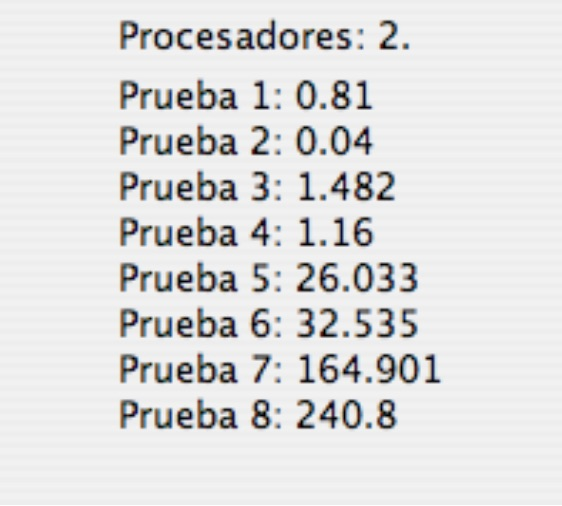

Figura 19. Hextress mostrando resultados

Las pruebas realizadas se identifican según la siguiente tabla:

| Prueba | Tablero | Algoritmo ejecutado |
|:-----:|:-------:|---------------------|
| 1 | 3 | Paralelo    |
| 2 | 3 | Secuencial  |
| 3 | 4 | Paralelo    |
| 4 | 4 | Secuencial  |
| 5 | 5 | Paralelo    |
| 6 | 5 | Secuencial  |
| 7 | 6 | Paralelo    |
| 8 | 6 | Secuencial  |

Estas pruebas consisten en dejar que el sistema juegue contra sí mismo para ciertos tableros, alternando la aplicación del algoritmo secuencial con la del paralelo. La idea es que el sistema ejecute las mismas operaciones en modo secuencial y en paralelo y las cronometre. Con los tiempos resultantes, se obtienen medidas fiables de los tiempos de procesado para cada opción, y se pueden comparar con más facilidad las diferentes opciones de ejecución.

De acuerdo a la tabla anterior, las pruebas típicas suponen la ejecución del modo demostración en tableros de dimensión de 3, 4, 5 y 6, alternando las versiones secuencial y paralela del algoritmo. Se pueden utilizar tableros mayores en las pruebas, pero los tiempos de procesamiento son elevados, y se pretendía que el programa se pudiera ejecutar rápidamente y que no comprometiera al usuario más de cinco minutos.

Realizando las pruebas tanto en equipos con varios procesadores como en equipos con uno sólo podremos concluir qué versión del algoritmo es más eficiente en principio para cada configuración de hardware, y nos permitirá aportar pruebas y tiempos concretos que justifiquen el diseño del sistema. Se trata de responder a la pregunta ¿justifica el gasto adicional en operaciones y en consumo de memoria de la versión paralela del algoritmo aportando mejores tiempos de procesado? La respuesta, como se explica en la siguiente sección, es afirmativa.

**Descripción de los equipos**

A continuación se detalla las configuraciones de los equipos que han participado en el estudio de casos, indicando el número de procesadores de cada uno de ellos. Los sistemas sombreados en gris tienen un único procesador, y sus resultados sirven para contrastar el resto.

| Id. | Procesadores | Modelo              | Frecuencia (GHz) | Memoria (MB) | Sistema operativo |
|:---:|:--:|---------------------|:----------------:|:------------:|-------------------|
| 1   | 2  | Intel Core 2 Duo    | 2                | 1024         | Mac OS 10.4.9     |
| 2   | 2  | Intel Core Duo      | 1,83             | 1024         | Mac OS 10.4.9     |
| 3   | 2  | Intel Core 2 Duo    | 2,33             | 2048         | Mac OS 10.4.10    |
| 4   | 4  | Intel Xeon          | 2,66             | 2048         | Mac OS 10.4.9     |
| 5   | 1  | Intel Centrino      | 2                | 1024         | Windows XP SP 2   |
| 6   | 2  | Intel Core Duo      | 2                | 1024         | Mac OS 10.4.10    |
| 7   | 2  | Intel Core Duo      | 2                | 2048         | Mac OS 10.4.10    |
| 8   | 2  | Intel Core Duo      | 1,83             | 1024         | Windows XP SP 2   |
| 9   | 2  | Intel Core 2 Duo    | 1,86             | 2048         | Windows XP SP 2   |
| 10  | 1  | AMD Athlon XP-M     | 1,2              | 256          | Windows XP SP 2   |

**Resultados**

En el Apéndice A, al final de la memoria, se adjuntan las hojas de datos con los resultados de las experiencias llevadas a cabo debidamente clasificados. También pueden consultarse en formato de hoja de cálculo en el soporte digital que acompaña a esta memoria.

A continuación se muestran una serie de gráficas que relacionan el tiempo de procesado de una partida completa con el tamaño del tablero de la partida en cuestión. Tiempos menores implican un mejor rendimiento del sistema.

Para sistemas monoprocesador (equipados con un único microprocesador): 

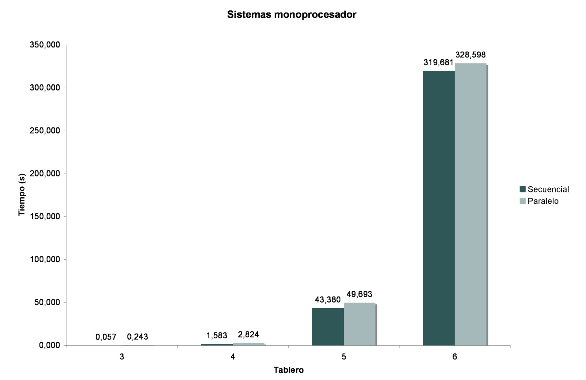

Figura 20. Gráfico de tiempos para sistemas de un único procesador

Se observan rendimientos ligeramente mejores para el algoritmo secuencial que el paralelo, cuyas diferencias tienden a aumentar conforme se incrementa el tamaño del tablero. La mayor parte de las pruebas se realizó con equipos de dos procesadores, o de dos núcleos, con los siguientes resultados (promedios):

Figura 21. Tabla de tiempos para sistemas de dos procesadores

Se observa una mejora muy significativa de los tiempos para tableros medianos cuando se utiliza el algoritmo paralelo. Por último, para los sistemas de cuatro procesadores, se obtuvieron los siguientes resultados:

Figura 22. Tabla de tiempos para sistemas de cuatro procesadores

### Conclusiones

Los datos recogidos en las diversas pruebas nos permiten extraer ciertas conclusiones interesantes. En primer lugar para tableros pequeños, de dimensión menor o igual a 4, se observa mejor rendimiento para los algoritmos secuenciales en todos los casos. Este margen de beneficio es muy amplio en dimensión 3 y algo más reducido para la dimensión 4. A partir de dimensión 5, sólo en los equipos monoprocesador se obtienen mejores rendimientos en la versión secuencial.

Este mejor rendimiento del algoritmo secuencial para los tableros pequeños incluso en los equipos de varios procesadores se aprecia mejor en el siguiente diagrama, cuyo eje vertical utiliza la escala logarítmica para exagerar las diferencias:

Figura 23. Escala logarítmica para sistemas duales

Si el ordenador dispone de más de un procesador, en los tableros medios (de dimensión 5 y 6) se aprecian mejores rendimientos en los algoritmos paralelos. Por contra, si el ordenador sólo cuenta con un único procesador, los tableros medios siguen la progresión de los pequeños, y se observan mayores costes para el procesamiento paralelo que para el secuencial. Esto último es así porque la ejecución multihilo requiere más operaciones y más trabajo de la memoria, por lo que sólo compensa su uso cuando se dispone de más de un procesador que agilice la ejecución.

Como síntesis, se puede concluir que el algoritmo paralelo es óptimo para entornos multiprocesadores, por lo que el gasto adicional de procesador y memoria se compensa gracias a la ejecución concurrente, mientras que el algoritmo secuencial es más eficiente para equipos basados en un único procesador. En un sentido más amplio, podemos considerar que construir algoritmos menos eficientes puede ser rentable si a cambio podemos utilizar las capacidades de procesamiento paralelo del sistema.

 Esta conclusión se ha utilizado como base a la implementación de las capacidades automáticas de procesamiento paralelo que se han comentado en esta sección: dependiendo de las características del sistema se aplica la versión secuencial o la concurrente mediante el uso de polimorfismo. 

### Otras posibilidades evaluadas

**Procesamiento superpuesto**

Cuando se evaluó la posibilidad de crear una versión de varios hilos se consideró también la posibilidad de comenzar a evaluar una jugada mientras se terminaban las operaciones con la anterior. Finalmente se descartó porque esta opción no resultaba práctica ni se adaptaba a las características del sistema.

**Restricción del número de hilos**

Para reducir la carga del sistema, se implementó una versión que mantenía sólo dos hilos en ejecución cada vez, dejando el resto en una cola. Aunque en principio esta opción podía parecer interesante, el gasto de esperar a cada par de procesos antes de lanzar otros dos, penalizaba mucho los tiempos de ejecución, por lo que se descartó.

## Multiplataforma

Uno de los objetivos planteados en las fases previas es que la aplicación pueda ejecutarse en los sistemas operativos más extendidos (Linux, Windows y Mac OS). La tecnología Java, utilizada en este proyecto, permite la ejecución de código sobre una máquina virtual. Esto permite generar un código intermedio que después es interpretado por “adaptadores” específicos de cada sistema sin que sea preciso realizar una compilación separada.

Los componentes de la aplicación han sido desarrollados de manera que sea posible una integración adecuada en todos los sistemas.

## Eficiencia de las estructuras

A continuación se repasan algunas decisiones tomadas en torno a las estructuras de datos utilizadas, parte vital de este proyecto.

### Mapas hash

Java dispone de unas estructuras denominadas HashMap que vienen a ser una tabla basada en una clave hash. La ventaja de estas estructuras es que nos permiten relacionar objetos con arrays de otros objetos. Es decir, crear arrays cuyo índice es un objeto.

El algoritmo H-Search se basa en crear caminos de celdas entre dos celdas, lo que en principio aconseja esta implementación. Sin embargo, para soportar el esquema, fue necesario crear una extensión del HashMap, adaptada a utilizar dos índices en vez de uno. La figura siguiente muestra una aproximación de esta idea.

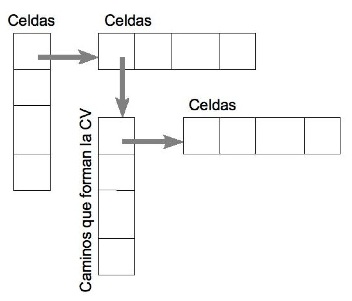

Figura 24. Un esquema algo complicado

Sin embargo, el coste de las operaciones es muy elevado, pues el HashMap ocupa mucho espacio en memoria y los accesos son lentos para cierto número de elementos.

Otra solución barajada fue la de representar los caminos entre dos celdas como un mapa de bits lógico de tres dimensiones. Sin embargo, esta opción tuvo que descartarse porque son necesarias ciertas operaciones adicionales en los contenedores de caminos, que a su vez precisan de otras operaciones y otros atributos especiales.

Los HashMap necesitan disponer de un valor que pueda servir como identificador único de cada elemento que indexan, si se quiere que las operaciones sean rápidas. Así, es necesario dotar a cada objeto celda de un identificador. Sin embargo, si cada objeto tiene un identificador entero y único, puede utilizarse este identificador como índice en una tabla. Luego planteando una tabla de referencias a contenedores de caminos (llamados “rutas”), puede darse salida a la misma funcionalidad que el HashMap en tiempos inferiores al 40%, según las pruebas realizadas.

¿Cómo asignar un identificador a cada celda? Cada celda queda identificada en principio por la fila y la columna en el caso de las casillas, y por el punto cardinal que representa en el caso de los bordes. Así, pues para el caso de las celdas:

Y en el caso de los bordes, se asignan a partir del último identificador ocupado por las casillas en orden creciente, según norte, sur, este y oeste.

### Listas y vectores

Java dispone de un tipo de estructura denominada ArrayList, que es una lista abstracta donde pueden guardarse objetos en orden, recuperarlos y ejecutar operaciones con mucha rapidez. Los algoritmos son muy óptimos, aunque se pierde eficiencia en relación a los arrays tradicionales cuando se hacen operaciones como recorrer los índices.

Así pues, en las partes donde se podía prescindir de estas estructuras con poca codificación adicional, así se ha hecho. En otras partes sencillamente no es viable por la cantidad de inserciones y eliminaciones de elementos. En algunos de estos casos se ha utilizado la función toArray(), que convierte la lista en un array convencional, que puede ser recorrido y accedido con mayor rapidez.

## Simulación de jugadas

El sistema utiliza un sistema algo novedoso al identificar cada jugada que debe probarse con una simulación. Esto permite llevar un control de las jugadas simuladas, el orden que ocupan en la partida, las estructuras a las que afectaron para deshacer los cambios... Este control permite reutilizar entre llamadas a simulaciones parte de las estructuras de la simulación anterior, deshaciendo los cambios convenientemente.

## Simplificación de celdas

Un conjunto de casillas vecinas ocupadas por el mismo jugador pueden considerarse como una sola. Desde el punto de vista del juego esto no es estrictamente cierto, pero sí desde el punto de vista de la heurística. Aunque parezca muy intuitivo, simplificar las casillas es una tarea ciertamente complicada, sobre todo porque se debe almacenar la traza de los cambios realizados para revertirlos al deshacer las simulaciones, siendo necesario observar multitud de excepciones y circunstancias diferentes al realizar estas operaciones.

La idea principal es que, por ejemplo, dada esta situación:

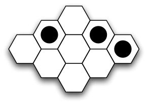

Figura 25. Una posición en el tablero

Si representamos el tablero anterior como un grafo, tendríamos:

Figura 26. El equivalente en grafo

Y teniendo en cuenta que dos casillas vecinas pueden considerarse como una sola, esto equivaldría a:

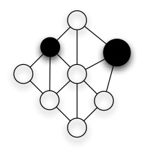

Figura 27. Simplificando casillas

Existen situaciones donde se puede obtener un beneficio muy significativo de esta propiedad, sirva como ejemplo la figura siguiente:

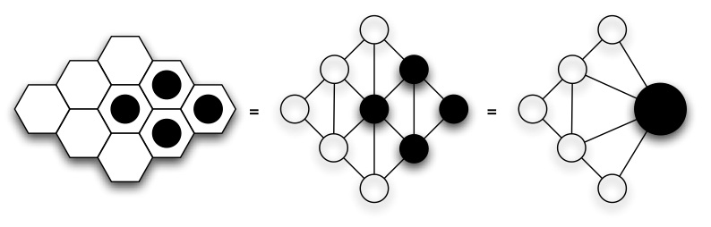

Figura 28. Eliminando tres casillas

Simplificar las casillas reduce el número de celdas que deben evaluarse, y en consecuencia incrementa la eficiencia de los algoritmos.

En la práctica, al ocupar una celda del tablero en la simulación de una jugada, se guarda una referencia a la celda que se ha eliminado, y se sustituye por la nueva. Acto seguido, se copian en la nueva las referencias de las vecinas de la celda sustituida, siempre que no existieran previamente.

Cuando se deshace la simulación, se vuelve a incorporar la celda eliminada al tablero y se restablecen las conexiones.

## Otros aspectos interesantes

### Diferentes modos de juego

El sistema permite ejecutar el juego en distintos modos. Así, para cada nueva partida se ofrecen las opciones:

Jugar un humano contra el ordenador, pudiendo configurar qué jugador comenzará moviendo.

Jugar un humano contra otro humano, deshabilitando la respuesta automática para este modo, y permitiendo a ambos contendientes enfrentarse con el programa ejerciendo de árbitro.

Modo de demostración. Este modo permite observar al ordenador jugando contra sí mismo, lo cual resulta interesante a efectos de estudiar la calidad de la heurística.

En los dos primeros modos, el sistema dispone de la opción de sugerir la mejor jugada según su criterio. El jugador que recibe la sugerencia puede aceptarla o bien ejecutar otro movimiento a su elección.

### Sugerir jugadas

El jugador en posesión del turno puede solicitar al sistema que sugiera cuál es, a su juicio, la mejor jugada. La jugada aparece señalada en el tablero y el usuario puede aceptarla o bien ejecutar otro movimiento a su elección.

### Regla de intercambio

El sistema permite, al crear una partida, activar o desactivar la regla de intercambio. Esto permite al jugador decidir si intercambia el primer movimiento, haya sido generado por el ordenador o por otro humano.

Si no desea intercambiar el movimiento, el segundo jugador puede ejecutar cualquier otro sobre el mismo tablero.

### Tablas de aperturas

El primer movimiento es generado mediante una tabla estática que contiene los mejores movimientos, diferenciando el caso de que la regla de intercambio esté activada o no. Con las características actuales, el sistema juega siempre en la casilla central si la regla de intercambio está desactivada. En caso contrario, ejecuta una buena jugada menos tentadora para el contrario, para que éste no la intercambie pero al mismo tiempo pueda mantener cierta ventaja.

### Nivel de juego configurable

El sistema permite configurar el nivel de juego de la heurística al crear una nueva partida y durante el transcurso de las mismas. La selección del nivel se traduce internamente en una mayor o menor profundidad del árbol de búsqueda y detalle de las búsquedas. En la aplicación, el usuario puede configurar el nivel entre “modo normal” y “modo experto”. El modo normal trabaja con una altura en el árbol de búsqueda de 2 y el modo experto con 3. Estos valores aportan resultados muy buenos. El modo experto es útil para finales de partida y tableros pequeños donde existen ciertas sutilezas que el modo normal no llega a detectar.

### Interfaz gráfica de usuario

Se calcula que más de el 90% de las pruebas de prototipado y desarrollo se hicieron en modo texto, minimizando la dependencia de la interfaz gráfica. La implantación de la misma se ha realizado respetando la independencia de los módulos lo máximo posible, de manera que la lógica interna del programa sea independiente. Esto permitirá, llegado el caso, utilizar el motor de decisión sobre otra interfaz, o implantarlo en un servidor de juegos que cuente con su propio frontal gráfico.

Se ha prestado especial atención en el diseño de los gráficos de la pantalla principal del juego para lograr un entorno atractivo, sencillo y lo más intuitivo posible.

## Dificultades

A lo largo de este desarrollo se han presentado multitud de problemas y dificultades. El resultado global es el resultado de un ejercicio continuo de aportar soluciones y de contrastar alternativas.

La primera dificultad fue la falta de documentación sobre el juego. Esta situación ha ido corrigiéndose con el paso del tiempo, aunque queda mucho camino por recorrer. A la falta de referencias sobre el juego se une la falta de documentación explícita sobre implementación de programas capaces de jugar al hex. Mientras existen, por la propia tradición informática, infinidad de estudios sobre el ajedrez o las damas, que exponen con claridad cómo diseñar buenas heurísticas e incluso ejemplos, apenas hay disponible nada sobre el hex, más que los dos o tres artículos a los que nos hemos referido.

En el estudio inicial se reflejó como crítica la gestión de la complejidad. Sin embargo, la división en módulos, el propio paradigma orientado a objetos y las herramientas de Java, han reducido este problema a lo anecdótico.

# Conclusiones

Los métodos de búsqueda basados en árbol se utilizan ampliamente en juegos de computador y se tratan con detalle en la mayor parte de la bibliografía sobre Inteligencia Artificial (IA). Sin embargo, cabe señalar que estrictamente, estos métodos poco o nada tienen de IA, sino que son más bien métodos matemáticos deterministas que simulan una forma de proceder humana, aunque formalizada para el caso de las máquinas.

Los avances más interesantes en el campo de los juegos vienen precisamente en la aplicación de técnicas de IA en la resolución del juego. Dichas técnicas se han implementado satisfactoriamente en el programa **Blondie24**, que utiliza una red de neuronas artificial para jugar a las damas, superando a los mejores jugadores humanos. De hecho hace tiempo que no se permite a los ordenadores competir contra humanos en los torneos de damas.

El hex es un juego con una naturaleza muy ligada a las matemáticas, y una bella muestra de cómo estructuras sencillas pueden combinarse y dar lugar a sistemas complejos. La mayor dificultad cuando nos enfrentamos a la computación de este juego es, precisamente, la de eliminar su máscara superficial de entretenimiento y adentrarnos en su desbordante lógica subyacente.

La idea que ha permitido que los ordenadores puedan jugar al hex se escapa del ámbito de los juegos y la propia inteligencia artificial para enraizarse sólidamente en las matemáticas. A diferencia de la mayoría de los juegos abstractos computables, los métodos que nos permiten elegir el mejor movimiento en el hex no se basan en las utilidades ni en los valores de las casillas, sino en el estudio de los grafos que describen el juego a nivel interno, en plena compenetración con las matemáticas. La ingeniería y su sentido más práctico se mezcla en la mágica idea de tratar las conexiones en estos grafos como circuitos eléctricos, y permite hacer posible el complicado sueño de jugar al hex contra una máquina.

La idea clave es la **unión**. Desde la arquitectura del computador, las interfaces gráficas, la orientación a objetos o las estructuras de más bajo nivel de la ingeniería informática; hasta la teoría de juegos, los grafos o el álgebra de las ecuaciones en las matemáticas, pasando por la teoría de circuitos de la física… todas las disciplinas se unen y trabajan en sincronía en la compleja tarea de encontrar la mejor jugada en un juego que se aprende en unos segundos.

## Líneas de trabajo futuras

Como en la mayoría de este tipo de proyectos, tan abiertos a mejoras y cambios, es fácil que el sistema no llegue a terminarse nunca. Entre las ideas más interesantes para futuras versiones figuran:

Continuar obteniendo datos sobre procesamiento paralelo que permitan su comparación con versiones posteriores.

La posibilidad de añadir un sistema de aprendizaje basado en redes de neuronas artificiales, lo que permitiría que el sistema evolucionara con el tiempo.

Estudiar la posibilidad de implantar un sistema de cálculo distribuido entre varios equipos.

Estudiar cómo pueden reducirse algunas estructuras a un nivel más bajo para mejorar el rendimiento.

Formalizar protocolos de comunicaciones con otros programas. Es posible que se intente liderar el esfuerzo de la comunidad de desarrolladores por llegar a un consenso en la definición de un protocolo que permita a las aplicaciones comunicarse y jugar entre ellas.

Respecto a cuestiones menores, más relacionadas con funciones del software, destacan las siguientes:

Funciones de deshacer y rehacer movimientos, permitiendo avanzar y retroceder por el historial de jugadas. En el hex implantar esta característica no es en absoluto trivial, y de hecho la mayoría de los programas no la incluyen.

Más rapidez en la decisión de las jugadas. Sería necesario estudiar los algoritmos y ver cómo se pueden reutilizar ciertos cálculos.

Permitir guardar y abrir partidas. Sería interesante utilizar un formato XML para esta característica.

Prever que la interfaz se muestre en el idioma del sistema, y permitir generar ficheros de traducciones.

# Reconocimientos

Este proyecto comenzó a gestarse ya a finales del año 2005. Que este complicado viaje haya terminado en buen puerto es mérito colectivo de muchas personas.

**René Reynaga** sugirió la idea de estudiar este juego en concreto, aportó su conocimiento del mismo e infinidad de conceptos interesantes de los que este proyecto se ha nutrido.

**Luis Alonso Romero** proporcionó bibliografía y referencias muy valiosas sobre Inteligencia Artificial y resultó de gran ayuda a lo largo de este largo proyecto.

**Rafael García–Bermejo** aportó ideas muy interesantes como la posibilidad de realizar un procesamiento con varios hilos y la optimización de algunas estructuras para acortar los tiempos de ejecución. Asimismo, atendió mis consultas con excelente disposición y enorme paciencia.

**Eduardo Alberto de la Peña** se convirtió por unos días en un auténtico tutor virtual aportando un método muy interesante para calcular la resistencia de los circuitos eléctricos.

**Eladio Sanz **y **Marcelino Zazo** colaboraron con una disposición excelente en el estudio de los algoritmos que permitieran generalizar la resolución de los circuitos eléctricos.

**Carlos Polo** es el coautor de la primera versión de la biblioteca de clases para hex escrita en C++ [8] y que sirvió como base a la realización de este proyecto. Además, se prestó a discutir ciertos aspectos metodológicos y aportó sus valiosas opiniones.

**Marián Torrecilla** obtuvo tiempo de donde no lo había para revisar y corregir una buena parte de la memoria aportando interesantes comentarios y anotaciones. 

## Beta testers

Las siguientes personas colaboraron en el desarrollo de este sistema permitiendo, con una excelente disposición, que la aplicación Hextress se ejecutara en sus equipos y enviaron de vuelta los resultados de la ejecución, permitiendo su tabulación y su posterior análisis. Una buena parte de este trabajo no habría sido posible sin ellos:

- Inés López
- Olga Molina
- Carlos Polo
- Pablo Ramos
- Roberto Sánchez
- Marián Torrecilla

# Referencias

A continuación se muestra un listado de la documentación referida en el texto:

- [1] Vadim V. Anshelevich. *A hierarchical approach to computer Hex*. **Artificial Intelligence**, 2001.
- [2] Edward A. Bender. *Mathematical Methods in Artificial Intelligence*. IEEE Computer Society Press, 1996.
- [3] S. Even; R. E. Tarjan. *A Combinatorial Problem Which is Complete in Polynomial Space*. **Journal of the ACM** 23, October 1976.
- [4] Stefan Reisch. *Hex ist PSPACE-vollständig*. **Acta Informatica** 15:167–191, 1981.
- [5] Jack van Rijswijck. *Computer Hex: Are Bees Better Than Fruitflies?* Master’s thesis, University of Alberta, 2000.
- [6] Thomas Maarup. *Hex: Everything You Always Wanted to Know About Hex But Were Afraid to Ask*. University of Southern Denmark, 2005.
- [7] Oskar Morgenstern; John von Neumann. *The Theory of Games and Economic Behavior*. Princeton University Press, 1947.
- [8] C. Polo; P. Torrecilla. *Biblioteca de clases para hex*. Universidad de Salamanca, 2006.
- [9] S. J. Russell; P. Norvig. *Inteligencia artificial. Un enfoque moderno*. Pearson Educación, 2004.
- [10] Nils J. Nilsson. *Inteligencia artificial. Una nueva síntesis*. McGraw-Hill, 2001.
- [11] Vadim V. Anshelevich. *The Game of Hex. An Automatic Theorem Proving Approach to Game Programming*. **Artificial Intelligence**, 2000.
- [12] D. Gale. *The game of Hex and the Brouwer fixed-point theorem*. **American Mathematical Monthly** 86 (1979): 818–827.
- [13] Paul A. Tipler. *Física para la ciencia y la tecnología*. Reverté, 2001.
- [14] C.E. Shannon. *Computers and automata*, Proceedings of Institute of Radio Engineers 41 (1953) 1234–1241.

## Otra bibliografía

Otras referencias bibliográficas consultadas durante la elaboración del proyecto:

- [15] I. Jacobson, G. Booch, J. Rumbaugh*. El proceso unificado de desarrollo de software*. Adisson-Wesley, 2000.

- [16] I. Jacobson, G. Booch, J. Rumbaugh*. El lenguaje unificado de modelado: manual de referencia*. Adisson-Wesley, 2000.

- [17] A. Durán, B. Bernárdez*. Metodología para la elicitación de Requisitos de Sistemas Software*. Universidad de Sevilla, 2002.

- [18] A. Durán, B. Bernárdez. *Metodología para el Análisis de Requisitos de Sistemas Software*. Universidad de Sevilla, 2001.

- [19] Judy Bishop. *Java: fundamentos de programación*. Addison-Wesley, 1999.

- [20] Bruce Eckel. *Piensa en Java*. Pearson Educación, 2002.

## Recursos en Internet

De todas las referencias consultadas, se muestran a continuación las más interesantes. Se ha creído conveniente mostrar en cada caso una breve descripción sobre el sitio referido.

- Hexwiki. Sitio tipo wiki con información muy detallada sobre el hex.
http://hexwiki.org [Última vez visitado: 25 de junio de 2007].
- Interactive Multipurpose Server. Sitio web con gran cantidad de documentación
sobre matemáticas y recursos, como applets para resolución de sistemas de
ecuaciones, sisemas de trazado automáticos… http://wims.unice.fr [Última vez
visitado: 13 de marzo de 2007].
- Wolfram MathWorld. Completo sitio web con multitud de recursos sobre
matemáticas. http://mathworld.wolfram.com [Última vez visitado: 10 de abril de
2007].
- Numerical recipes. Colección de libros online que abordan la computación de
los diferentes métodos matemáticos. http://www.nrbook.com [Última vez
visitado: 15 de mayo de 2007].
- Métodos numéricos. Libro online con información sobre métodos numéricos.
http://www.uv.es/~diaz/mn/fmn.html [Última vez visitado: 15 de marzo de 2007].
- Curso de computación. Recopilación de datos teóricos sobre resolución de
sistemas de ecuaciones lineales. http://www.uv.es/~diaz/mn/fmn.html [Última
vez visitado: 10 de marzo de 2007].
- Wikipedia. Enciclopedia libre on-line (Utilizada como fuente secundaria).
http://wikipedia.org [Última vez visitado: 17 de junio de 2007].
- Mac Project planning software. En este artículo (en inglés) se encontró
información muy útil sobre ese tipo de aplicaciones para entornos Mac OS.
http://www.anyware.co.uk/2005/2006/03/23/mac-project-planning-software
[Última vez visitado: 4 de junio de 2007].
- JSience. Librería científica para Java. http://jscience.org [Última vez visitado: 5
de junio de 2007]